# <span style="color:darkorange">Camunda Workshop</span> 

_<span style="color:blue">**Author**</span>: Francesco Gandelli \
<span style="color:blue">**Date**</span>: 23 February 2024_

---

## <span style="color:darkorange">Goal of the project</span>

This project aims to create a progressive implementation of a Camunda workflow
starting from a standalone/concept design solution to the implementation.

---
## <span style="color:darkorange">The proposed approach</span>

The proposed approach of this project is as follows:
- Initially design a BPM process and test it using Camunda Standalone
- Then remove business data from the Workflow
- And then connect the Workflow to external resources
- Finally create a Camunda embedded solution

---
## <span style="color:darkorange">Proposed Architecture adoption</span>

The following technologies are used inside the project:
- SpringBoot 3.1
- Java 17
- Camunda 7.20

---
## <span style="color:darkorange">Prerequisites</span>

The project is developed under Windows 11.

- Download camunda standalone: https://downloads.camunda.cloud/release/camunda-bpm/run/7.20/camunda-bpm-run-7.20.0.zip
- Download camunda modeler: https://downloads.camunda.cloud/release/camunda-modeler/5.20.0/camunda-modeler-5.20.0-win-x64.zip
- Download jdk 17+: https://adoptium.net/temurin/releases/?version=17 file .zip for windws x64
- Set up path variable. From windows search box run: 

```dos
	rundll32.exe sysdm.cpl,EditEnvironmentVariables
```

Set up **JAVA_HOME** to the jdk 17 you just downloaded.

---
## <span style="color:darkorange">Let's start</span>

&nbsp;

### Table of contents
1. [Create a simple workflow](#step1)
2. [Create a variable and pass from one task to another](#step2)
3. [Add a gateway. Create collapsed and extended subprocess](#step3)
4. [Loop on password validation. Boundary events](#step4)
5. [Escalate and call external rest service](#step5)
6. [Resiliency and Retry](#step6)\
	I. [BPMN based](#step6-1)\
	II. [Camunda engine based](#step6-2)
7. [Kafka integration through sidecar pattern](#step7)
8. [Transaction and compensation](#step8)
9. [Cross-process interaction](#step9)
10. [Service mesh integration](#step10)
11. [Integration with external application](#step11)
12. [DMN and custom endpoints](#step12)
13. [Working with external business data](#step13)

&nbsp;

<div id='step1'/>

### **Step 1: create a simple workflow**

&nbsp;

1. Run camunda-bpm-run-7 standalone from unzipped folder:

	```dos
	start.bat
	```

2. Run camunda-modeler-5 from unzipped folder with a double click

3. Create the following easy diagram

	

4. Deploy it and start the process

5. Complete manually from task list the task.

&nbsp;

<div id='step2'/>

### **Step 2: create a variable and pass from one task to another**

&nbsp;

1. Add to the user task the following configuration:

	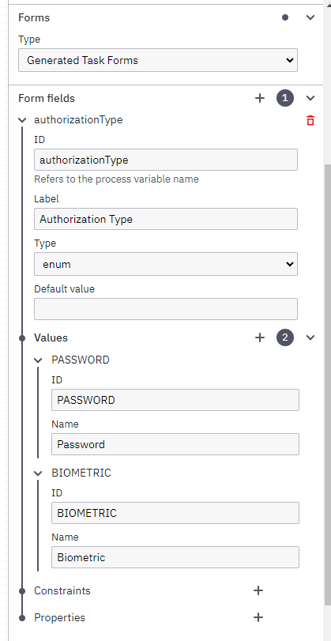

2. Add a script task to receive and print the variable chosen by user:

	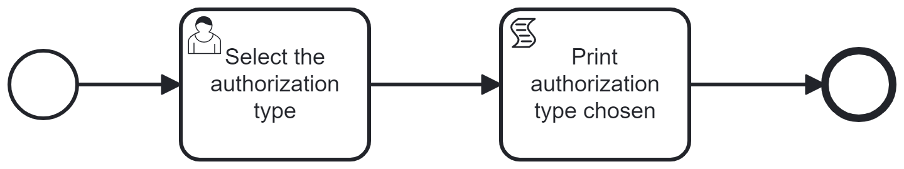

3. Configure the script task as follows:

	*Format*: groovy \
	*Type*: Inline script \
	*Script*: 
	```groovy
	println "The authorization type chosen is " + autorizationType
	```

	Pay attention that *autorizationType* is the wrong name of the variable set in the previous user task.

4. Deploy it and start the process

5. Open the task and select a value.

6. Complete the task: you will see an error. In console you can see a java stack exception.

7. You can delete the task uncompletable by rest api.

8. Correct the *groovy* script and update the name of variable as follows:

	```groovy
	println "The authorization type chosen is " + authorizationType
	```
9. Deploy again the process and start it

10. Complete the task choosing Biometric value: this time in console you can read: `The authorization type chosen is BIOMETRIC`

&nbsp;

<div id='step3'/>

### **Step 3: add a gateway. Create a collapsed subprocess and an extended one**

&nbsp;

1. Change the process as follow:

	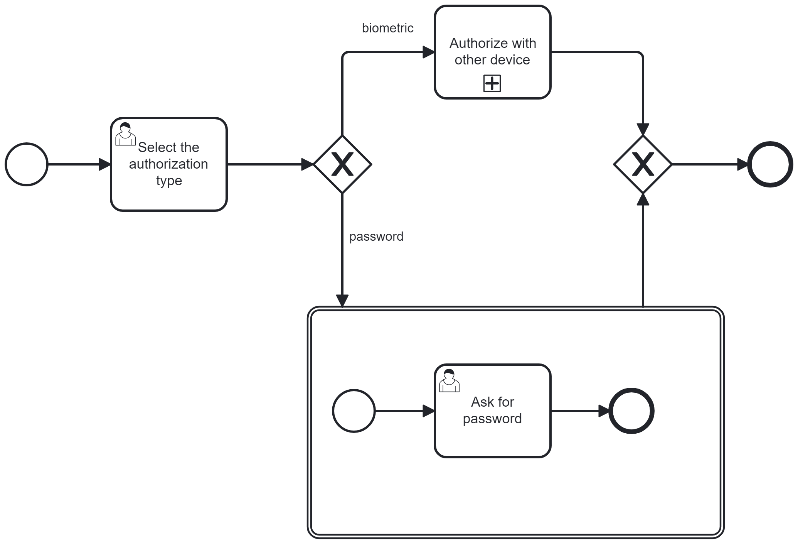

2. Selecting the collapsed subprocess you can enter in the subprocess. Create the following subprocess:

	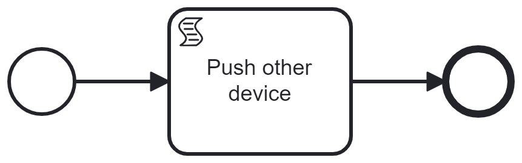

3. Let's add configuration for the gateway. The arrow `biometric` will have a condition configured as follows:

	*Type*: expression
	*Condition Expression*: `${authorizationType == "BIOMETRIC"}`
	
	The arrow password will be configured with this expression: `${authorizationType == "PASSWORD"}`

	Note that the value is the ID of the enum and not the name

4. To check that the gateway works correctly configure in subprocess the script task as follows:

	```groovy
	println "Biometric authorization push another device"
	```

5. Now deploy the process and start it from tasklist.

6. You should see the task `Select the authorization type`

7. Select `Password` and a new task `Ask for password` appear in task list

8. Select `Biometric` and in console you might read `Biometric authorization push another device`

&nbsp;

<div id='step4'/>

### **Step 4: loop on password validation. Boundary events**

&nbsp;

1. Change the process as follows:

	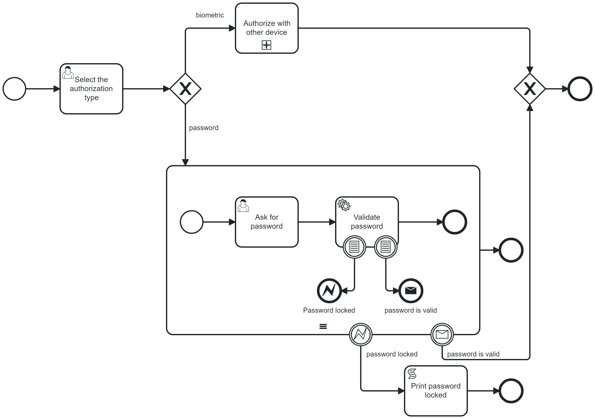

2. Let's configure the task `Ask for password` with a generated task forms with just one field that we name password. Type is string

3. Then configure the task service `Validate password`. This task will be of type Expression and the expression will be as follow:

	```java
	${execution.getVariable("password").equals("111111")}
	```
 Set the name of result variable to `isValid`. This configuration set the variable isValid equals to the value of the check performed in expression.

4. Now select the *boundary conditional event* that is linked to the message. Set the condition variable name equal to `isValid`, variable events that trigger the event are `create,update` and the type of condition is the followin `Expression`:

	```java
	${isValid == true} 
	```
5. The message password is valid needs 2 configurations: the first one is the message reference. In section `Message` set PasswordIsValid as *message name*. Then in order to work the event has to be implemented to correlate the message with the BPM engine. To do this select the implementation type `Expression` and fill in the following way the expression:

	```java
	${execution.getProcessEngineServices().getRuntimeService().createMessageCorrelation("PasswordIsValid").correlateWithResult()}
	```

6. The previous configuration send and correlate the message with all camunda processes that are listening to this message. The boundary catch message linked to the arrow password is valid has to be setup in `Message` section to listent to the message PasswordIsValid

7. Finally let's look to the error case. Before to setup the error configure the subprocess as a sequencial multi-instance process. 

	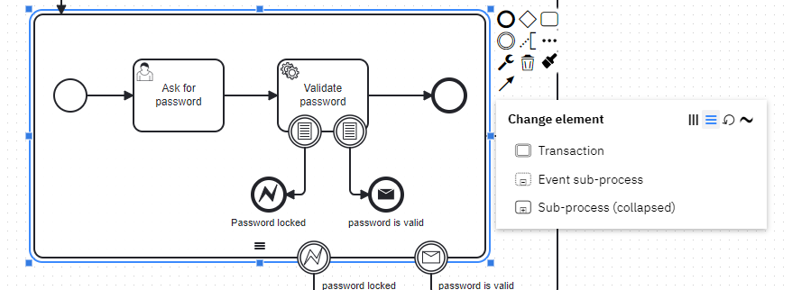

	The `Loop` marker also exists, but it is just an annotation that indicates that the task has embedded a loop, while the loop between task is performed using the `Sequential multi-instance` that is the marker with 3 horizontal parallel lines. 

	The implementation of the loop is automatically performed. You should indicate the `Loop cardinality` that in our case is equal to 3 tentatives that customer can try to input the right password; then indicate the `Completion condition` as follows:

	```java
	${execution.getVariable("isValid")==true}
	```

	In this way the loop will be ended when the password will be valid.

8. Let's configure the conditional event linked to the error password locked. The condition variable name is `isValid`, the trigger events like in the other conditional event are `create,update` and the type Expression is: 

	```java
	${isValid == false && loopCounter == 2}
	```

9. In order to throw the exception in the end event error linked to the previous conditional event we have to define the global error reference as `PasswordLocked`. 

10. To catch the error we have to configure the boundary exception event to the global error reference `PasswordLocked`. In this case is possible to indicate the variables name for the error code and message so that the next task could log the error. For this exercise we have just written a groovy script task that print in console the following message:

	```groovy
	println "Password should be blocked"
	```

11. Once all configurations are done you can deploy and test the process. If you put a password different than 111111 after 3 times you will exit with the message `Password should be blocked`, instead if you put the 111111 password the process will be completed succesfully.

&nbsp;

<div id='step5'/>

### **Step 5: Escalate and call external rest service**

&nbsp;

1. As first step you have to download a new spring boot project. Use the following command or paste the url in your browser:

	```
	curl "https://start.spring.io/starter.zip?type=maven-project&language=java&bootVersion=3.2.2&baseDir=externalservice&groupId=org.gfs.workshop.camunda.rest&artifactId=externalservice&name=externalservice&description=External%20Service%20called%20by%20Camunda%20Workflow&packageName=org.gfs.workshop.camunda.rest.externalservice&packaging=jar&javaVersion=17&dependencies=lombok,web" --output externalservice.zip
	```
	
	Then unzip the archive and open it in IntelliJ

2. Add a package controller with the following class:

	```java
	@Controller
	@RequestMapping("/external-service")
	@AllArgsConstructor
	public class SmsEndpoint {
		private final SmsService smsService;
		@PostMapping(value = "/sms", produces = MediaType.APPLICATION_JSON_VALUE)
		public ResponseEntity<Result> sendSms(@RequestBody Receiver receiver) {
			Result result = smsService.sendSms(receiver);
			if (result.sendingResult()) {
				return ResponseEntity.ok(result);
			} else {
				return ResponseEntity.badRequest().body(result);
			}
		}
	}
	```

3. Add the package model with the following records:

	```java
	public record Receiver(String phoneNumber, String message) {
	}

	public record Result(Boolean sendingResult, String errorMessage) {
	}
	```

4. Add the service under the service package:

	```java
	@Service
	@Slf4j
	public class SmsService {

		public Result sendSms(Receiver receiver) {
			log.info("Send sms. Message is: {}", receiver.message());
			if (Objects.isNull(receiver.phoneNumber())) {
				return new Result(false, "Phone number is required");
			}
			return new Result(true, null);
		}
	}
	```

5. Add the test class as follows:

	```java
	@SpringBootTest(webEnvironment = SpringBootTest.WebEnvironment.RANDOM_PORT)
	public class SmsEndpointComponentTest {

		@LocalServerPort
		int port;
		@Test
		public void runTest() {
			RestTemplate restTemplate = new RestTemplate();
			Result result = restTemplate.exchange(
					"http://localhost:"+port+"/external-service/sms",
					HttpMethod.POST,
					new HttpEntity<>(new Receiver("+39111223344", "Test message")),
					Result.class
			).getBody();
			assert result != null;
			Assertions.assertTrue(result.sendingResult());
			Assertions.assertNull(result.errorMessage());
		}

		@Test
		public void runTestNotOk() {
			RestTemplate restTemplate = new RestTemplate();
			HttpClientErrorException exception = Assertions.assertThrows(HttpClientErrorException.class, () -> restTemplate.exchange(
					"http://localhost:" + port + "/external-service/sms",
					HttpMethod.POST,
					new HttpEntity<>(new Receiver(null, null)),
					Result.class
			));
			assert exception != null;
			Assertions.assertEquals(HttpStatusCode.valueOf(400), exception.getStatusCode());
			Assertions.assertNotNull(exception.getResponseBodyAsString());
		}
	}
	```

	and test it running `mvn test`

6. Run the application using `mvn spring-boot:run '-Dspring-boot.run.arguments="--server.port=8900"'`

7. Go to the Camunda Modeler, remove the script task. Add an event subprocess expanded that catch an escalation and call a task service to send sms. The final result should be as follows:

	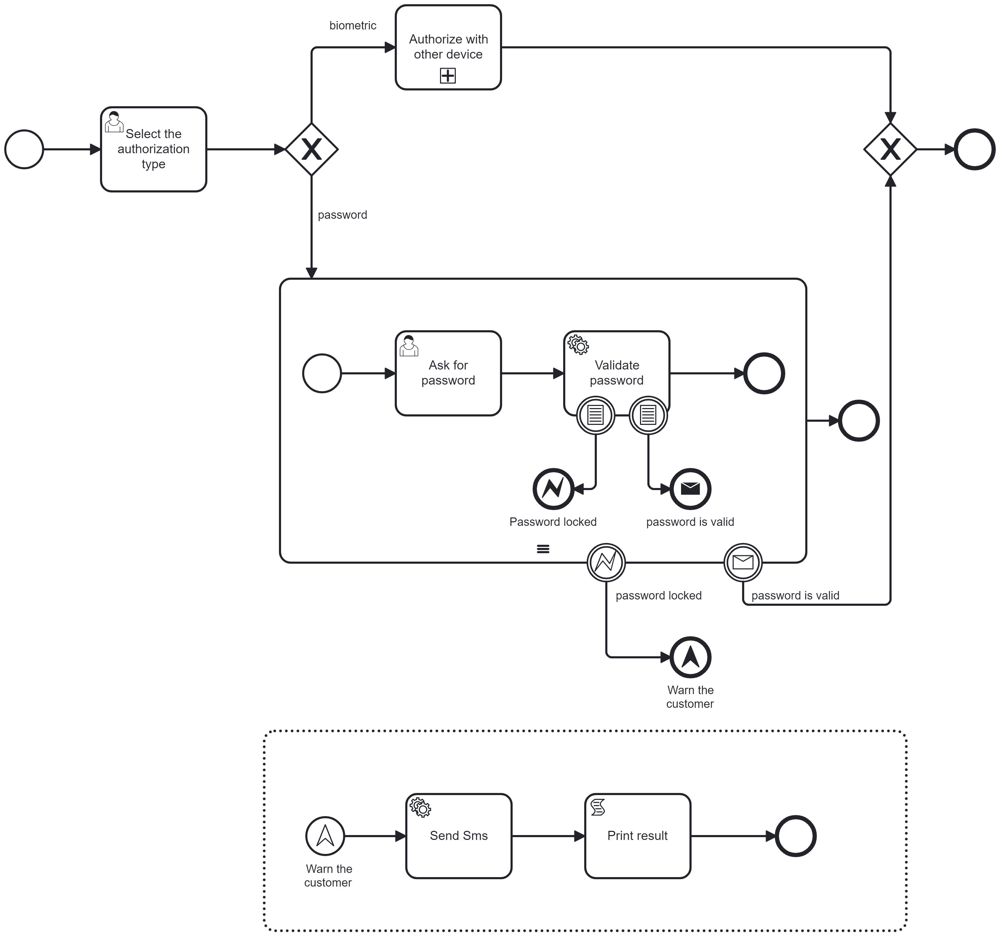

8. Configure the Escalate end event `Warn the customer` declaring the global escalation reference as `WarnCustomer` with code `warn` and set up the receive Escalate event with the same event.

9. To call the rest service that was started at step #6 configure the task Send SMS as follows:
	- Set Implementation type as `Connector` and Connector ID is `http-connector` 
	- Set the *connector inputs* variables:
		- headers: set the map entries `Content-Type: application/json` and `Accept: application/json`
		- method: set the string `POST`
		- url: set the string `http://localhost:8900/external-service/sms`
		- payload: set it as a javascript with the following source code:
			```javascript
				var payload = {
					"phoneNumber": "+39111223344",
					"message": "Send sms from Camunda Process for reason code " + execution.getVariable("escalateCode")
				}

				JSON.stringify(payload);
			```
	- Set the *connector outputs* variable with name `response` defined as expression `${S(response)}`. This will convert the response object in json using a [Camunda Spin Framework](https://docs.camunda.org/manual/7.20/reference/spin/).
	- Pass the connector response to the next task setting a variable *resultSms* as expression `${response}`
	- Add an Execution Listener to handle the status code different than 2xx as and *end* Event Type. Implement it with the following javascript:

		```javascript
		if (statusCode>299) {
			throw new org.camunda.bpm.engine.ProcessEngineException("Error sending SMS: " + response, statusCode); 
		}
		``` 

10. After this complex configuration you can configure a script to print the sms sending result in console with a script task based on the following javascript code:
	```javascript
	java.lang.System.out.println("Result of sending: " + execution.getVariable("resultSms"));
	```

11. At this point you can deploy and run the process. When you input the wrong password (different than 111111) for three times, the call will be performed and the result will be printed in console. In external service log you will see the call.

	```
	2024-02-20T11:13:55.873+01:00  INFO 26152 --- [nio-8900-exec-2] i.f.w.c.r.e.service.SmsService           : Send sms. Message is: Send sms from Camunda Process for reason code warn
	```

&nbsp;

<div id='step6'/>

### **Step 6: Resilience and Retry**
&nbsp;

<div id='step6-1'/>

#### **I. BPMN based**

1. It is possible to implement in BPMN the retry. Change the diagram as follows:

	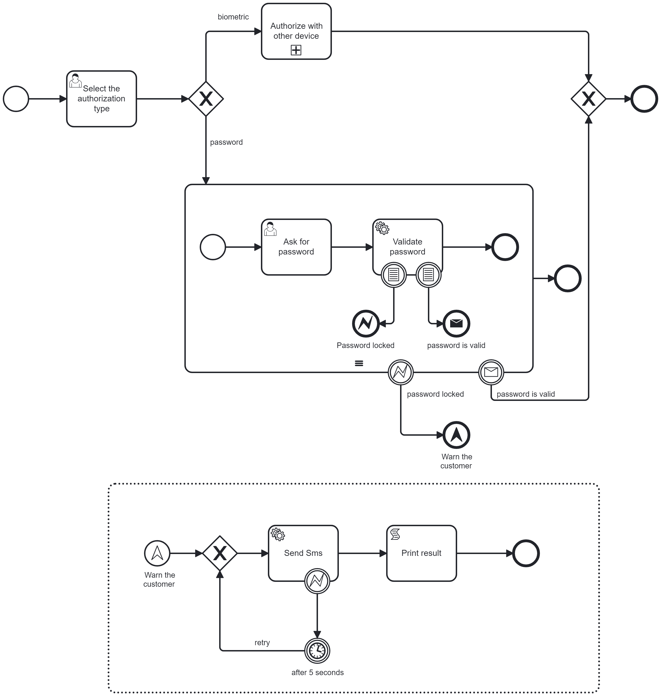

2. Set up for `Send SMS` task an execution listener for the event type `end` as javascript using the following source code:

	```javascript
	if (statusCode>299 && execution.getVariable("retryCounter")<3) {
		execution.setVariable("retryCounter", execution.getVariable("retryCounter")+1);
		throw new org.camunda.bpm.engine.delegate.BpmnError("restError");
	}
	```

3. Then add an execution listener also to the Escalate catch event to initialize the counter. Again add the listener with type `end` as javascript using the following source code:

	```javascript
	execution.setVariable("retryCounter",0);
	```

4. Set the timer duration to `PT5S` for 5 seconds

5. Set up the event error boundary catch for an error with the following configuration:
	- Name: `RestError`
	- Code: `restError` - Pay attention that this is the error raised by script

6. Now deploy the process and try it. Run the external service to send sms you created in previous step. Then Start the process and put the wrong password (different than 111111) three times. The process will be completed and the message you can see in console is: 
	```
	Tentative #0
	Result of sending: {"sendingResult":true,"errorMessage":null}
	```
	The call was executed successfully so the system completed the process.

7. Now change in task `Send SMS` the script of payload. Set the `"phoneNumber"` Json property equal to null:

	```json
	{
		"phoneNumber": null,
		"message": "Send sms from Camunda Process for reason code " + execution.getVariable("escalateCode")
	}
	```

	and deploy the process again. Start the process and put 3 times the wrong password. The external service will return a statusCode `400 - Bad request` and you can see in *Cockpit* application the process that is running the timer. If you look the console of external service you can see that every 5 seconds it receives a call. After 3 tentatives the Camunda console will print:

	```
	Tentative #0
	Result of sending: {"sendingResult":false,"errorMessage":"Phone number is required"}
	```

&nbsp;

<div id='step6-2'/>

#### **II. Camunda engine based**


>**NOTE:** *It is possible to implement the retry using the automatic retry of asynchronous task of Camunda. Make explicit in BPMN the retry behavior can bring advantages for clarity, but at the same time could bring some disadvantages. Consider that desribe a technical retry is not business oriented and that the diagram increase its complexity in reading. In addition to this there is a limit in Camunda 7 for which if a service is unavailable the task exit before to evaluate executionListener and a manual incident is opened automatically, so in those cases the BPMN retry wouldn't be performed. 
For this reason the Camunda Engine approach is preferrable. If you Start back from the diagram of Step 5 you have just few steps to implement the retry.*

1.  Set up the asynchronous continuation of `Send SMS` task. Activate the checkbox under *Asynchronous continuations* `Before` and `Exclusive` and put the following *Job execution - Retry time cycle* expression: `R3/PT5S`. This configuration makes starting a new thread to execute the call and if it fails it retry automatically. In this way even if the service is unavailable the retry will be executed.

2. Add the *Connector output* variable `statusCode` set with the expression `${statusCode}`. 

3. Add the *Execution listeners* script for *end event* as a javascript with the following source code to force the error when the response is a logical failure:

	```javascript
	if (statusCode>299) {
    	throw new org.apache.http.HttpException("Error sending sms : " + response); 
	}
	```

4. Finally to test it set the `"phoneNumber"` Json property in task `Send SMS` to null in the script of payload:

	```json
	{
		"phoneNumber": null,
		"message": "Send sms from Camunda Process for reason code " + execution.getVariable("escalateCode")
	}
	```

5. Deploy the process and test it. When you will put for 3 times the wrong password the system will run an automatic retry.

&nbsp;

<div id='step7'/>

### **Step 7: Kafka integration**

>*Camunda 8 provides a native kafka-connector. Camunda 7 instead doesn't provide such connector, but in any case a connector in Camunda 7 is useful just to send message to external assets.\
The choice in this project is instead to create a Camunda sidecar. This approach enables:*\
*- the technology independency*\
*- the correlation of messages with Camunda*\
*- the support of a service mesh*\
*- the delegation of any security policy*

1. Create a new repository named `sidecar` using this command or copying in your browser just the url:

	```
	curl https://start.spring.io/starter.zip?type=maven-project&language=java&bootVersion=3.2.2&baseDir=sidecar&groupId=org.gfs.workshop.camunda&artifactId=sidecar&name=sidecar&description=Sidecar%20for%20Kafka%20integration&packageName=org.gfs.workshop.camunda.sidecar&packaging=jar&javaVersion=17&dependencies=lombok,web,kafka
	```

2. Adjust pom.xml in this way to support avro schema:
	- Add the properties:
		```xml
		<kafka-avro-serializer.version>7.5.1</kafka-avro-serializer.version>
		<avro-maven-plugin.version>1.11.3</avro-maven-plugin.version>
		```
	- Add the dependencies for confluent:
		```xml
		<dependency>
			<groupId>io.confluent</groupId>
			<artifactId>common-config</artifactId>
			<version>7.4.0</version>
		</dependency>

		<dependency>
			<groupId>io.confluent</groupId>
			<artifactId>kafka-avro-serializer</artifactId>
			<version>${kafka-avro-serializer.version}</version>
			<exclusions>
				<exclusion>
					<groupId>org.apache.kafka</groupId>
					<artifactId>kafka-clients</artifactId>
				</exclusion>
			</exclusions>
		</dependency>
		```
	- Add the plugin for avro schema (if you use avro schema in your kafka instance):
		```xml
		<plugin>
			<groupId>org.apache.avro</groupId>
			<artifactId>avro-maven-plugin</artifactId>
			<version>${avro-maven-plugin.version}</version>
			<executions>
				<execution>
					<phase>generate-sources</phase>
					<goals>
						<goal>schema</goal>
					</goals>
					<configuration>
						<stringType>String</stringType>
						<sourceDirectory>${project.basedir}/src/main/resources/avro/</sourceDirectory>
					</configuration>
				</execution>
			</executions>
		</plugin>
		```

3. Add avro schemas in src/main/resources/avro. The following file and schema should be added:

	File: `camunda_request.avsc`
	```json
	{
		"name": "CamundaRequestEvent",
		"type": "record",
		"doc": "Event used by Camunda to request an action to other applications",
		"namespace": "org.camunda.kafka",
		"fields": [
			{
				"name": "workflowId",
				"type": "string"
			},
			{
				"name": "taskId",
				"type": "string"
			},
			{
				"name": "feedbackRequired",
				"type": "boolean"
			},
			{
				"name": "feedback",
				"type": [
					"null",
					{
						"name": "FeedbackRecord",
						"type": "record",
						"fields": [
							{
							"name": "feedbackEvent",
							"type": "string"
							},
							{
								"name": "feedbackType",
								"type": {
									"type": "enum",
									"symbols": [
									"SIGNAL",
									"MESSAGE"
									],
									"name": "FeedbackTypeEnum"
								}
							}
						]
					}
				],
			"default": null
			},
			{
				"name": "data",
				"type": {
					"type": "map",
					"values": "string"
				}
			}
		]
	}
	```

	File: `camunda_feedback.avsc`
	```json
	{
		"name": "CamundaFeedbackEvent",
		"type": "record",
		"doc": "Event used to trigger a feedback to Camunda",
		"namespace": "org.camunda.kafka",
		"fields": [
			{
				"name": "workflowId",
				"type": "string"
			},
			{
				"name": "taskId",
				"type": "string"
			},
			{
				"name": "result",
				"type": {
					"name": "ResultEnum",
					"type": "enum",
					"symbols": [
					"OK",
					"NOK"
					]
			}
			},
			{
				"name": "timestamp",
				"type": "string"
			},
			{
				"name": "componentName",
				"type": "string"
			},
			{
			"name": "Feedback",
			"type": [
				"null",
				{
					"name": "FeedbackRecord",
					"type": "record",
					"doc": "Schema used to define feedback",
					"fields": [
						{
						"name": "feedbackEvent",
						"type": "string"
						},
						{
							"name": "feedbackType",
							"type": {
								"type": "enum",
								"symbols": [
								"SIGNAL",
								"MESSAGE"
								],
								"name": "FeedbackTypeEnum"
							}
						}
					]
				}
			],
			"default": null
			},
			{
				"name": "data",
				"type": {
					"type": "map",
					"values": "string"
				}
			}
		]
	}
	```
4. Rename `application.properties` to `application.yaml` and paste the following kafka configuration:

	```yaml
	kafka:
	  request-topic: workshop_camunda_request_topic
	  feedback-topic: workshop_camunda_feedback_topic

	spring:
	  kafka:
		bootstrap-servers: localhost:9092
		properties:
		  schema:
			registry:
			  url: http://localhost:8081
			  ssl:
				keystore:
				  location: src/main/resources/mycert.jks
				  password: changeit
				truststore:
				  location: src/main/resources/mycert.jks
				  password: changeit
				key:
				  password: changeit
		  spring.deserializer.key.delegate.class: org.apache.kafka.common.serialization.StringDeserializer
		  spring.deserializer.value.delegate.class: io.confluent.kafka.serializers.KafkaAvroDeserializer
		  specific.avro.reader: true
		producer:
		  key-serializer: org.apache.kafka.common.serialization.StringSerializer
		  value-serializer: io.confluent.kafka.serializers.KafkaAvroSerializer
		consumer:
		  key-deserializer: org.springframework.kafka.support.serializer.ErrorHandlingDeserializer
		  value-deserializer: org.springframework.kafka.support.serializer.ErrorHandlingDeserializer
		  group-id: camunda-sidecar-local
		  auto-offset-reset: earliest
		auto.register.schema: false
	camunda:
	  server:
		url: http://localhost:8080/engine-rest
	```

5. Setup the project as follows:
	* `controller` package with java class `KafkaController`

		```java
		@Controller
		@RequestMapping("/kafka")
		@AllArgsConstructor
		public class KafkaController {
			private final KafkaService kafkaService;

			@PostMapping("/events/camunda/publishing")
			public ResponseEntity<Void> publishCamundaEvent(@RequestBody CamundaRequestEvent requestEvent) {
				kafkaService.publishCamundaEvent(requestEvent);
				return new ResponseEntity<>(HttpStatus.NO_CONTENT);
			}

			@PostMapping("/events/feedback/publishing")
			public ResponseEntity<Void> publishFeedbackForCamunda(@RequestBody CamundaFeedbackEvent requestEvent) {
				kafkaService.publishFeedbackForCamundaEvent(requestEvent);
				return new ResponseEntity<>(HttpStatus.NO_CONTENT);
			}

		}			
		```
	* `service` package with java class `KafkaService`

		```java
		@Service
		@RequiredArgsConstructor
		@Slf4j
		public class KafkaService {

			private final KafkaTemplate<String, SpecificRecord> kafkaTemplate;
			private final RestTemplate restTemplate;
			private final Function<CamundaFeedbackEvent, CorrelationMessageDto> mapFeedbackEventToCorrelationMessage =
					feedbackEvent ->
							CorrelationMessageDto.builder()
									.messageName(feedbackEvent.getFeedback().getFeedbackEvent())
									.processInstanceId(feedbackEvent.getWorkflowId())
									.build();

			private final Function<CamundaFeedbackEvent, SignalDto> mapFeedbackEventToCorrelationSignal =
					feedbackEvent ->
							SignalDto.builder()
									.name(feedbackEvent.getFeedback().getFeedbackEvent())
									.build();
			@Value("${camunda.server.url}")
			private String camundaServerUrl;

			@Value("${kafka.request-topic}")
			private String requestTopic;

			/**
			* Implement /kafka/events/camunda/publishing
			*
			* @param requestEvent a CamundaRequestEvent
			*/
			public void publishCamundaEvent(CamundaRequestEvent requestEvent) {
				sendEvent(requestTopic, requestEvent);
			}

			/**
			* Implement /kafka/events/feedback/publishing.
			* This endpoint is useful to simulate the other device publishing
			*
			* @param requestEvent a feedback event for Camunda
			*/
			public void publishFeedbackForCamundaEvent(CamundaFeedbackEvent requestEvent) {
				sendEvent("workshop_camunda_feedback_topic", requestEvent);
			}

			/**
			* Generic method to send kafka message
			*
			* @param topic  topic name
			* @param record avro object
			*/
			private void sendEvent(String topic, SpecificRecord record) {
				log.info("Sending message to kafka {}", record);
				CompletableFuture<SendResult<String, SpecificRecord>> sendingResult =
						kafkaTemplate.send(topic, record);

				sendingResult.whenComplete((result, exception) -> {
					if (Objects.isNull(exception)) {
						final RecordMetadata metadata = result.getRecordMetadata();
						log.info("Message successfully sent at {} _ {} bytes to topic {}.", metadata.timestamp(), metadata.serializedValueSize() + metadata.serializedKeySize(), metadata.topic());
					} else {
						log.error("Exception producing message {}", exception.toString());
					}
				});
			}

			/**
			* Message listener of Feedbacks. Call Camunda only when a feedback is provided
			*
			* @param feedbackEvent feedback event for Camunda received from topic
			*/
			@KafkaListener(topics = "${kafka.feedback-topic}")
			public void feedbackHandler(CamundaFeedbackEvent feedbackEvent) {
				log.info("Received message {}", feedbackEvent);
				if (Objects.nonNull(feedbackEvent.getFeedback())) {
					switch (feedbackEvent.getFeedback().getFeedbackType()) {
						case SIGNAL -> callCamunda(mapFeedbackEventToCorrelationSignal.apply(feedbackEvent),
								Void.class);
						case MESSAGE -> callCamunda(mapFeedbackEventToCorrelationMessage.apply(feedbackEvent),
								MessageCorrelationResultWithVariableDto.class);
					}
				}
			}


			/**
			* Message listener of Request coming from camunda. This is a mock of third party service.
			* Wait 5 seconds and send a response.
			*
			* @param requestEvent intercept request coming from camunda
			*/
			@KafkaListener(topics = "${kafka.request-topic}")
			public void mockRequestHandler(CamundaRequestEvent requestEvent) {
				log.info("** MOCK SERVICE ** - Received message {}", requestEvent);
				CompletableFuture.runAsync(() -> {
					try {
						Thread.sleep(5000);
						CamundaFeedbackEvent.Builder feedbackEvent = CamundaFeedbackEvent
								.newBuilder()
								.setComponentName("sidecar")
								.setTimestamp(LocalDateTime.now().format(DateTimeFormatter.ISO_DATE_TIME))
								.setResult(ResultEnum.OK)
								.setTaskId(requestEvent.getTaskId())
								.setWorkflowId(requestEvent.getWorkflowId())
								.setData(requestEvent.getData());
						if (requestEvent.getFeedbackRequired()) {
							feedbackEvent.setFeedback(requestEvent.getFeedback());
						}
						publishFeedbackForCamundaEvent(feedbackEvent.build());
					} catch (InterruptedException e) {
						throw new RuntimeException(e);
					}
				});
			}
			
			// private method to call Camunda through RestTemplate
			private <T, S> void callCamunda(T messageDto, Class<S> responseType) {
				log.info("Correlate message to Camunda {}", messageDto);
				try {
					restTemplate.postForObject(
							camundaServerUrl + "/message",
							messageDto,
							responseType
					);
				} catch (Exception e) {
					log.error("Exception calling Camunda engine: ", e);
				}
			}
		}
		```

	* in sidecar package add the following configuration class:

		```java
		@Configuration
		public class AppConfig {

			/**
			* Used to avoid to serialize schema and specificData fields of Avro generated objects
			* that make serialization fail.
			*/
			public interface IgnoreAvroSchemaProperty {
				@JsonIgnore
				void getSchema();

				@JsonIgnore
				void getSpecificData();
			}

			/**
			* Custom objectMapper patched with a mixin with the Interface IgnoreAvroSchemaProperty
			* @return patched object mapper
			*/
			@Bean
			@Primary
			public ObjectMapper objectMapper() {
				return new ObjectMapper()
						.addMixIn(SpecificRecord.class, IgnoreAvroSchemaProperty.class);
			}

			/**
			* Create rest template with custom object mapper (by default it would create a new
			* object mapper instance that would fail treating SpecificRecord objects)
			* @return rest template with custom object mapper
			*/
			@Bean
			public RestTemplate restTemplate() {
				RestTemplate template =  new RestTemplateBuilder()
						.setConnectTimeout(Duration.ofSeconds(30))
						.setReadTimeout(Duration.ofSeconds(30))
						.build();
				template.getMessageConverters().add(0, mappingJacksonHttpMessageConverter());
				return template;
			}

			/**
			* Set custom object mapper to the Jackson converter
			* @return Jackson converter with custom object mapper
			*/
			@Bean
			public MappingJackson2HttpMessageConverter mappingJacksonHttpMessageConverter() {
				MappingJackson2HttpMessageConverter converter =
						new MappingJackson2HttpMessageConverter();
				converter.setObjectMapper(objectMapper());
				return converter;
			}
		}
		```
	* Create the model to call Camunda under model.camunda. The models were created using the swagger editor starting from [OpenApi](https://docs.camunda.org/rest/camunda-bpm-platform/7.20/) definition of Camunda.

	```java
	@Data
	public class AtomLink {
		private String rel = null;
		private String href = null;
		private String method = null;
	}
	@Data
	@Builder
	public class CorrelationMessageDto {
		private String messageName;
		private String businessKey;
		private String tenantId;
		private Boolean withoutTenantId = false;
		private String processInstanceId;
		private Map<String, VariableValueDto> correlationKeys;
		private Map<String, VariableValueDto> localCorrelationKeys;
		private Map<String, VariableValueDto> processVariables;
		private Map<String, VariableValueDto> processVariablesLocal;
		private Boolean all = false;
		private Boolean resultEnabled = false;
		private Boolean variablesInResultEnabled = false;
	}
	@Data
	public class ExecutionDto {
		private String id;
		private String processInstanceId;
		private Boolean ended;
		private String tenantId;
	}
	@Data
	public class MessageCorrelationResultWithVariableDto {
		/**
		* Indicates if the message was correlated to a message start event or an  intermediate message catching event. In the first case, the resultType is  `ProcessDefinition` and otherwise `Execution`.
		*/
		@AllArgsConstructor
		public enum ResultTypeEnum {
			EXECUTION("Execution"),
			PROCESSDEFINITION("ProcessDefinition");

			private String value;

			@Override
			@JsonValue
			public String toString() {
				return String.valueOf(value);
			}

			@JsonCreator
			public static ResultTypeEnum fromValue(String text) {
				for (ResultTypeEnum b : ResultTypeEnum.values()) {
					if (String.valueOf(b.value).equals(text)) {
						return b;
					}
				}
				return null;
			}
		}

		private ResultTypeEnum resultType = null;
		private ProcessInstanceDto processInstance = null;
		private ExecutionDto execution = null;
		private Map<String, VariableValueDto> variables = null;

	}
	@Data
	public class ProcessInstanceDto {
		private String id;
		private String definitionId;
		private String businessKey;
		private String caseInstanceId;
		private Boolean ended;
		private Boolean suspended;
		private String tenantId;
		private List<AtomLink> links;
	}
	@Data
	@Builder
	public class SignalDto {
		private String name;
		private String executionId;
		private Map<String, VariableValueDto> variables;
		private String tenantId;
		private Boolean withoutTenantId;
	}
	@Data
	public class VariableValueDto {
		private Object value;
		private String type;
		private Map<String, Object> valueInfo;
	}
	```

6. You can check if everything works well running the application

	```dos
	mvn spring-boot:run '-Dspring-boot.run.arguments="--server.port=8500"'
	```	

	and calling it using these curls:

	```dos
	curl -X POST http://localhost:8500/kafka/events/camunda/publishing --data-raw "{\"workflowId\": \"da2fd17b-0d0f-4d00-b88e-13d0361073c1\",\"taskId\": \"7055fb17-b008-4142-98f2-dcf9f4d13dc2\", \"feedbackRequired\": true, \"feedback\":{\"feedbackEvent\":\"AuthorizedByOtherDevice\",\"feedbackType\":\"SIGNAL\"},\"data\": {\"author\":\"gandelfwiz\"}}" -H "Content-Type: application/json"

	curl -X POST http://localhost:8500/kafka/events/feedback/publishing --data-raw "{\"workflowId\": \"7b17db81-d0d0-11ee-a84d-581cf8936878\",\"taskId\": \"7055fb17-b008-4142-98f2-dcf9f4d13dc2\",\"result\": \"OK\",\"timestamp\": \"2023-01-23T01:03:10\",\"componentName\":\"curl\",\"feedback\":{\"feedbackEvent\":\"AuthorizedByOtherDevice\",\"feedbackType\":\"MESSAGE\"},\"data\": {\"author\": \"gandelfwiz\"}}" -H "Content-Type: application/json"
	```

7. Once you have created a working kafka sidecar you can interact with it from camunda process. Let's design the process of an authorization from another device. Go inside `Authorize with other device` subprocess and change it as follows:

	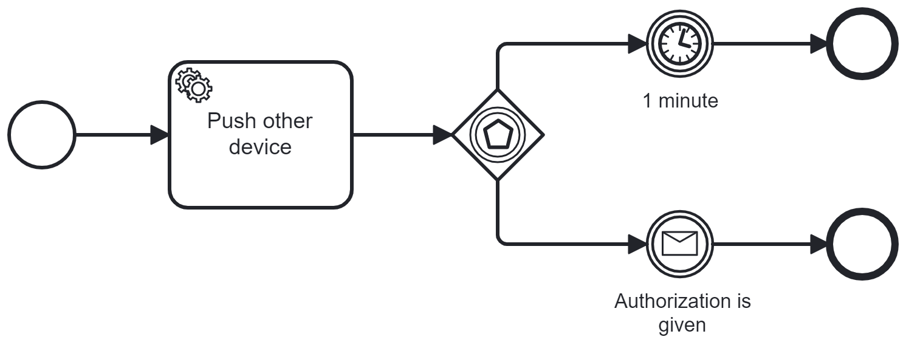

	The process send a push notification to the other device using a sidecar connected to Kafka. Then wait for an event: if in 1 minute it doesn't receive a response close the process, else it close the process 

8. To create step `Push other device` you can copy from escalate subprocess the task `Send SMS` and adjust it as follow:
	* Set the *payload* variable javascript as follows:
		```javascript
		var payload = {
			"workflowId": execution.getProcessInstanceId(),
			"taskId": execution.getId(),
				"feedbackRequired": true,
				"feedback": {
						"feedbackEvent": "AuthorizedByOtherDevice",
						"feedbackType": "MESSAGE"
				},
			"data": {
				"author": "gandelfwiz"
			}
		}

		JSON.stringify(payload);
		```
	
	* Set the *url* variable as follows: `http://localhost:8500/kafka/events/camunda/publishing`

9. Configure the catch event to the message `AuthorizedByOtherDevice`. The set up the timer duration to `PT1M` and in Execution Listener set a javascript for *end* event type. 

	```javascript
	throw new org.camunda.bpm.engine.ProcessEngineException("No response received from device"); 
	```

10. Deploy and start the process and the sidecar. This time choose the biometric authorization. You will see in sidecar log something similar:

	```s
	2024-02-21T20:21:30.301+01:00  INFO 24508 --- [nio-8500-exec-6] o.g.w.c.sidecar.service.KafkaService     : Sending message to kafka {"workflowId": "66b9f24f-d0ee-11ee-a84d-581cf8936878", "taskId": "6a7f85df-d0ee-11ee-a84d-581cf8936878", "feedbackRequired": true, "feedback": {"feedbackEvent": "AuthorizedByOtherDevice", "feedbackType": "MESSAGE"}, "data": {"author": "gandelfwiz"}}
	2024-02-21T20:21:30.424+01:00  INFO 24508 --- [ad | producer-1] o.g.w.c.sidecar.service.KafkaService     : Message successfully sent at 1708543290385 _ 121 bytes to topic workshop_camunda_request_topic.
	2024-02-21T20:21:30.426+01:00  INFO 24508 --- [ntainer#1-0-C-1] o.g.w.c.sidecar.service.KafkaService     : ** MOCK SERVICE ** - Received message {"workflowId": "66b9f24f-d0ee-11ee-a84d-581cf8936878", "taskId": "6a7f85df-d0ee-11ee-a84d-581cf8936878", "feedbackRequired": true, "feedback": {"feedbackEvent": "AuthorizedByOtherDevice", "feedbackType": "MESSAGE"}, "data": {"author": "gandelfwiz"}}
	2024-02-21T20:21:35.433+01:00  INFO 24508 --- [onPool-worker-8] o.g.w.c.sidecar.service.KafkaService     : Sending message to kafka {"workflowId": "66b9f24f-d0ee-11ee-a84d-581cf8936878", "taskId": "6a7f85df-d0ee-11ee-a84d-581cf8936878", "result": "OK", "timestamp": "2024-02-21T20:21:35.4337519", "componentName": "sidecar", "Feedback": {"feedbackEvent": "AuthorizedByOtherDevice", "feedbackType": "MESSAGE"}, "data": {"author": "gandelfwiz"}}
	2024-02-21T20:21:35.503+01:00  INFO 24508 --- [ad | producer-1] o.g.w.c.sidecar.service.KafkaService     : Message successfully sent at 1708543295463 _ 157 bytes to topic workshop_camunda_feedback_topic.
	2024-02-21T20:21:35.505+01:00  INFO 24508 --- [ntainer#0-0-C-1] o.g.w.c.sidecar.service.KafkaService     : Received message {"workflowId": "66b9f24f-d0ee-11ee-a84d-581cf8936878", "taskId": "6a7f85df-d0ee-11ee-a84d-581cf8936878", "result": "OK", "timestamp": "2024-02-21T20:21:35.4337519", "componentName": "sidecar", "Feedback": {"feedbackEvent": "AuthorizedByOtherDevice", "feedbackType": "MESSAGE"}, "data": {"author": "gandelfwiz"}}
	2024-02-21T20:21:35.538+01:00  INFO 24508 --- [ntainer#0-0-C-1] o.g.w.c.sidecar.service.KafkaService     : Correlate message to Camunda CorrelationMessageDto(messageName=AuthorizedByOtherDevice, businessKey=null, tenantId=null, withoutTenantId=null, processInstanceId=66b9f24f-d0ee-11ee-a84d-581cf8936878, correlationKeys=null, localCorrelationKeys=null, processVariables=null, processVariablesLocal=null, all=null, resultEnabled=null, variablesInResultEnabled=null)
	```

11. To test the timer you should set up the payload javascript property `feedbackRequired` to false. Deploy, run the process and wait. An incident will be created.

&nbsp;

<div id='step8'/>

### **Step 8: Transaction and Compensation**

> A transaction is a set of tasks that should be executed consistently. If one task in the chain fails an action should do to compensate the previous actions done.
	BPMN offers the possibility to explicitly declare this behavior with specific elements.\
	In our example we want to create a process of a Fuel Dispenser. The steps to dispense fuel are the following:\
	&nbsp;&nbsp;&nbsp;&nbsp;1. The machine reserve the charge on credit card of customer\
	&nbsp;&nbsp;&nbsp;&nbsp;2. Then the fuel dispenser provide the fuel as requested\
	&nbsp;&nbsp;&nbsp;&nbsp;3. Finally the machine actualizes the charge.\
	In this scenario we have to decide what happens when the second step or the third one fails.\
	In case of *fuel dispenser out of order*, we have already processed the step 1, so we have to cancel the charge reservation.\
	In case of *issue in actualization of reservation*, we can't remove the charge reservation since the fuel is already dispensed and can't be received back. So the only compensation action we can do is to send the payment to the customer credit card issuer through a file at the end of day.\
	This is a common scenario that in processes are in place and like in a SAGA pattern we have to compensate actions already done.	So let's see in detail how to implement this behavior.

1. Create a new `dispensation` process as follows:

	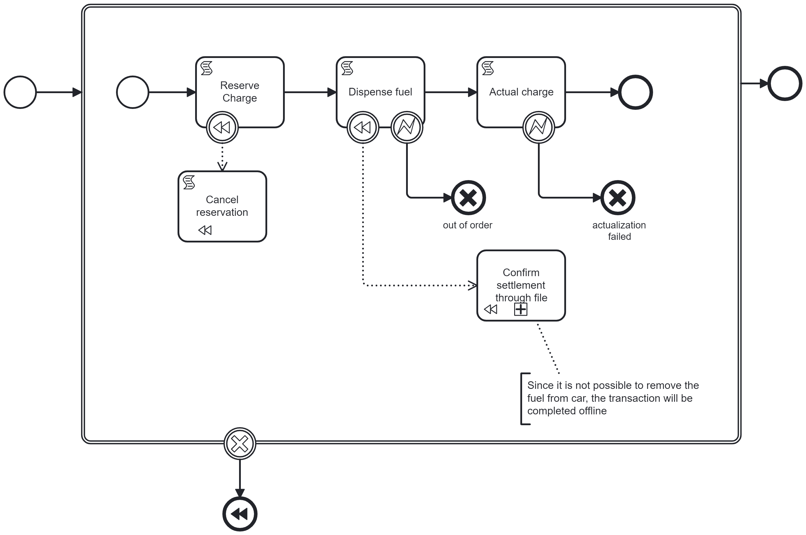

	and the subprocess `Confirm settlement through file` as follows:

	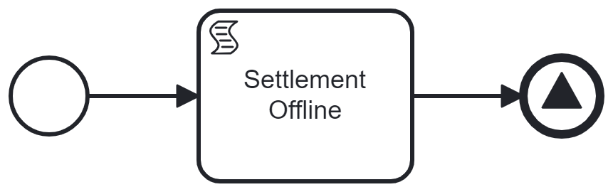

	Note that to clarify the type of compensation a comment is added in the main process. Since usually compensation is an opposite action than the original, in this case is better to clarify that in case of compensation of fuel dispensed we can just conclude in different way the process.

2. Setup the task `Reserve charge` with the groovy script `println "Reserve charge on credit card"`

3. In order to test the different compensation we want to receive a variable when the process is started. The variable will be used as a flag in the process. Let's call the variable `errorRequired` as a string that can have the value `0` that is OK, `1` to fail the fuel dispensation, `2` to fail the charge actualization. To avoid that process fails when the variable is not set, let's define a default value for the variable equal to `0`. Let's do this selecting the background of the process and adding an execution listener for *start* event type with a javascript as follows:

	```javascript
	if (execution.getVariable("errorRequired") == null) {
		execution.setVariable("errorRequired", 0);
	}
	```

	In this way we can implement the flag logic inside the script tasks. Add the following javascript to `Dispense fuel` implementation:

	```javascript
	var checkError = execution.getVariable("errorRequired");
	if ( errorRequired == "1" ) {
		console.log('Dispenser is out of order');
		throw new org.camunda.bpm.engine.delegate.BpmnError("dispenserError");
	} else {
		console.log('Fuel is dispensed succesfully');
	}
	```

	and the following to `Actual charge`:

	```javascript
	var checkError = execution.getVariable("errorRequired");
	if ( errorRequired == "2" ) {
		console.log('Actualization is failed');
		throw new org.camunda.bpm.engine.delegate.BpmnError("actualError");
	} else {
		console.log('Card is debited successfully');
	}
	```
4. Before to implement the compensation tasks there is a thing to keep in mind: in case of fuel is dispensed it is not possible cancel the reservation anymore, but it should proceed with the settlement by file. For this reason we have to handle another variable that we set to true after the fuel is dispensed. Since the execution listener for `end` event type is executed although the task fails, we will intercept the execution listener `start` event type with the javascript 
	```javascript
	execution.setVariable("dispensed", true);
	```
	In this way the compensation task `Cancel reservation` will print the compensation just in case dispensed is not defined or is false. Following a groovy script for implementation:
	```groovy
	if (execution.getVariable("dispensed") == null
		|| !execution.getVariable("dispensed")) {
			println "Cancel reservation"
	}
	```

5. In `Confirm settlement by file` subprocess implement `Settlement offline` script as groovy script: 

	```groovy
	println "Settlement is offline"
	```

6. Set up the signal end event selecting the option `Propagate all variables` and adding an execution listener as *start* event type with the following javascript:

	```javascript
	execution.setVariable("payload", '{"amount": ' + Math.round(Math.random()*100) + '}');
	```

	In this way the signal event will send to all catchers process the variable `payload` where a random amount is specified.

7. Deploy the process and run it. In console you should read:

	```
	Reserve charge on credit card
	Fuel is dispensed succesfully
	Card is debited successfully
	```

	Then try to rerun it setting `errorRequired` equals to 1. In console you can read:

	```
	Reserve charge on credit card
	Dispenser is out of order
	Cancel reservation
	```

	Then finally try to rerun it setting `errorRequired` equals to 2. In console you can read:

	```
	Reserve charge on credit card
	Fuel is dispensed succesfully
	Actualization is failed
	Settlement is offline
	```

&nbsp;

<div id='step9'/>

### **Step 9: Cross-process interaction**

In Camunda is possible to call a process from another external process. The engine allows to handle parameter sending and to use event messages to interact with a loose coupling.

1. Let's create an orchestration process for the two processes created until now and let's call it `Fuel delivery`

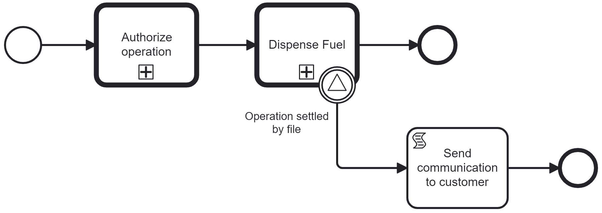

2. Let's use the call activity to call the processes already created. The idea of this process is that customer should authorize the card debit before to proceed with the fuel dispensation. Set up the `Authorize operation` to call a *BPMN element* and the called element will be `AuthorizationProcess`.

3. Proceed at the same way with `Dispense Fuel` to call a *BPMN element* and the called element will be `DispensationProcess`. Remember that the process of dispensation requires the `errorRequired` variable as input parameter. You can provide it using *In mappings* section. Set up a source expression `${"2"}` with target variable errorRequired. In this way you can share just errorRequired with the called process.

4. Configure the signal boundary event of `Dispense Fuel` setting the global signal reference equals to `OperationSettledByFile`

5. Finally print a message in console with a groovy script in `Send communication to customer` task

	```groovy
	println "Communication to customer, payment will be settled by tomorrow"
	```

6. There is a way to couple loosely two processes using messages. Remember that a message end event can be correlated with one process a time, instead a signal can be correlate with as many as processes are waiting for it. If you deploy and run the `Fuel delivery` process you will see in console:

	```
	Reserve charge on credit card
	Fuel is dispensed succesfully
	Actualization is failed
	Settlement is offline
	Communication to customer, payment will be settled by tomorrow
	```

	The process catch the signal we have defined in `DispensationProcess` and proceed with the execution of boundary event.

7. Let's see now how to settle up the payment in offline mode. Let's create a new process that we call `Infra day settlement`. The rule that we want to put in place is to flush in a file the payments switched to offline settlement every *n* record or every interval of time. Let's set up the following process.

	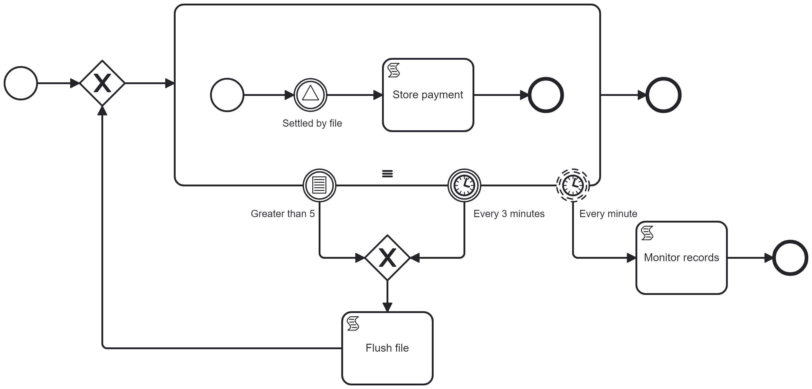

	and let's see how to realize this behavior using Camunda and Script tasks.

8. In `InfiniteLoopRestart` exclusive join gateway setup a javascript

	```javascript
	execution.setVariable("internalCounter", 0);
	```

9. Configure the cardinality of the process to 7 and in initial event of subprocess add the following javascript:

	```javascript
	execution.setVariable("internalCounter", execution.getVariable("internalCounter") + 1);
	```

10. Configure the catch signal event to listen to the global signal reference `OperationSettledByFile`. 

11. Set up the script task `Store payment` to set up a variable that is assigned to the current iteration assigning the payload as value:

	```javascript
	var recordKey = "record-" + internalCounter;
          execution.setVariable(recordKey, execution.getVariable("payload"));
	```

12. The conditional boundary event will have the condition configure as follows: 
	* Variable name: `internalCounter`
	* Variable events: `update`
	* Type: `Expression`
	* Condition expression: `${internalCounter > 5}`

	The timer boundary event will have a duration of `PT3M`.

	The timer boundary non-interrupting event will have a cycle scheduled with the following *crontab* expression compliant to the *quartz* library requirements: `0 1/1 * * * ?`

13. Finally set up the `Flush file` task with the following javascript:
	```javascript
	for (var i = 1; i < internalCounter; i++) {
          var recordKey = "record-" + i;
          var recordValue = execution.getVariable(recordKey);
          console.log("Record " + i + ": " + recordValue);
          execution.removeVariable(recordKey);
        }
	```

14. Deploy and run the `Fuel delivery` process or the `DispensationProcess` with `errorRequired` equals to `2`. The 5th time the console will log:

	```
	Tentative #0
	Reserve charge on credit card
	Fuel is dispensed succesfully
	Actualization is failed
	Settlement is offline
	Record 1: {"amount": 45}
	Record 2: {"amount": 3}
	Record 3: {"amount": 23}
	Record 4: {"amount": 7}
	Record 5: {"amount": 86}
	Communication to customer, payment will be settled by tomorrow
	```

	You can see that signal is consumed by both the processes. `Fuel delivery` send communication to customer while `Infra day settlement` add the record to the basket to write to file. Note that timer non-interrupting boundary event works as a monitor and provides you periodically the messages received without interrupt the loop in progress:

	```
	Reserve charge on credit card
	Fuel is dispensed succesfully
	Actualization is failed
	Settlement is offline
	Reserve charge on credit card
	Fuel is dispensed succesfully
	Actualization is failed
	Settlement is offline
	11:45:25 - Received 2 records until now.
	11:46:00 - Received 2 records until now.
	11:47:15 - Received 2 records until now.
	Record 1: {"amount": 81}
	Record 2: {"amount": 62}
	11:48:05 - Received 0 records until now.
	11:49:20 - Received 0 records until now.
	```

&nbsp;

<div id='step10'/>

### **Step 10: Service mesh integration**
>In order to integrate Camunda with a service mesh, to keep the technology independency you can create a sidecar that handle registrations and security policies and communicate in localhost with Camunda. Service mesh rules are inside Ing and they are based on **Merak**, **Peer Token**, **Access Token** and **Service Discovery**.

To make Camunda available in the network you should: 

1) Register an API with the OpenApi definition of Camunda on Touchpoint Portal
2) Create certificates for the Application
3) Create a sidecar using the certificates you have created and using the Manifest of your application. The name of Application in certificate should be the same of your Engine. Sidecar will have the following property configured:

	```properties
	sidecar.meshed-app-port: 8080
	```

For this workshop we make it more simple. We implement a simple proxy endpoint in our sidecar that when called forward the request to Camunda exactly like a sidecar without the security part.

1) Just create the class `CamundaForwarder` with the following endpoint:

	```java
	@Controller
	@RequestMapping("/camunda")
	@RequiredArgsConstructor
	public class CamundaForwarder {
		private final RestTemplate restTemplate;

		@Value("${camunda.server.url}")
		private String camundaServerUrl;

		@RequestMapping(value = "/**", method = {
				RequestMethod.GET, 
				RequestMethod.DELETE, 
				RequestMethod.POST, 
				RequestMethod.PUT, 
				RequestMethod.PATCH
		})
		public ResponseEntity<?> proxyCamundaRestApi(@RequestBody(required = false) String requestBody,
														HttpServletRequest request) {
			String targetUrl = camundaServerUrl +
					"/" + Arrays.stream(request.getRequestURI().split("/"))
					.skip(2)
					.collect(Collectors.joining("/"));
			return restTemplate.exchange(targetUrl,
					HttpMethod.valueOf(request.getMethod()),
					new HttpEntity<>(requestBody),
					Object.class);
		}
	}
	```	
	
2) Call the following endpoint:
	```s
	curl http://localhost:8500/camunda/history/incident
	```

	The sidecar will return the response from Camunda.

3) Now stop the sidecar and rerun it with the following command:

	```s
	mvn spring-boot:run '-Dspring-boot.run.arguments="--server.port=0"'
	```

	In this case the port is random and so you can't predict where you have to call the service. In a service mesh environment not just the port isn't predictable, but also the url can be unpredictable.

4) Let's try to create quickly a service discovery to find our service. If all services in network are linked to a service discovery you will have the service mesh. For our experiment download the binary of consul from this page: https://developer.hashicorp.com/consul/install

5) Unzip the archive and from command line run:

	```s
	consul agent -dev
	```

	This command runs a basic service discovery provided by consul, the option -dev create just one node that can run in localhost.

6) Now change the sidecar solution as follows to integrate in sidecar with spring cloud the consul client:
	* add to `pom.xml` the following dependency:

	```xml
	<dependency>
		<groupId>org.springframework.cloud</groupId>
		<artifactId>spring-cloud-starter-consul-discovery</artifactId>
		<version>4.1.0</version>
	</dependency>
	```

	* add to application.yaml the following properties:

	```yaml
	spring:
	  cloud:
		consul:
		host: localhost
		port: 8500
		discovery:
			enabled: true
			register: true
			deregister: true
			instance-id: ${spring.application.name}:${vcap.application.instance_id:${spring.application.instance_id:${random.value}}}
			heartbeat:
			  enabled: true
			  ttl: 5s
	  application:
	    name: CamundaSidecar
	```

	* add to application.yaml in test folder the following properties:

	```yaml
	spring:
	  cloud:
		consul:
		  service-registry:
			auto-registration:
            enabled: false
	```

7) Start the sidecar application like in step #3 with port 0

8) Open your browser and look for http://localhost:8500/v1/health/service/CamundaSidecar. Search `port` and you can find the port to call. Let's suppose it's `62310` you can query camunda calling your sidecar with the following curl:

	```s
	curl http://localhost:62310/camunda/process-definition
	```

This exercise clarifies how the sidecar can integrate Camunda in service mesh. The changes you applied to the sidecar to activate and register the service to service discovery couldn't be applied to Camunda unless you don't embed Camunda libraries in your application creating a strong technology dependency between Camunda and service mesh integration implementation.

&nbsp;

<div id='step11'/>

### **Step 11: Integration with external application**
> The goal of this step is to start from an external web page the workflow of Authorization and set the password when customer choices this authorization mode.

1) To proceed with this solution we need first of all put a gateway that queries the service discovery and resolve the call. To do this download nginx from the following link: https://nginx.org/download/nginx-1.25.4.zip
	Download also consul-template that we will use to configure nginx: https://releases.hashicorp.com/consul-template/0.37.0/consul-template_0.37.0_windows_amd64.zip

2) Unzip the two archives in subfolders *consul/* and *nginx/*. In consul-template folder add the following configuration file: 

	`consul_template.hcl`
	```properties
	template {
		source = "../nginx/conf/nginx-template.conf"
		destination = "../nginx/conf/consul-nginx.conf"
		command = "../nginx/nginx -s reload"
	}

	consul {
		address="localhost:8500"
		
		retry {
			enabled = true
			attempts = 10
			backoff = "300ms"
		}
	}
	```

3) In nginx folder, under conf/ subfolder add this template:

	`nginx-template.conf`

	```properties
	upstream camunda {
		{{- range service "CamundaSidecar" }}
			server localhost:{{ .Port }};
		{{- end }}
	}

	server {
		listen 80;

		location /workflow/ {
			rewrite ^/workflow/(.*) /camunda/$1 break;
			proxy_pass http://camunda;
			proxy_set_header Host $host;
			proxy_set_header X-Real-IP $remote_addr;
			proxy_set_header X-Forwarded-For $proxy_add_x_forwarded_for;
			proxy_set_header X-Forwarded-Proto $scheme;
			proxy_set_header Origin "";
			
			add_header 'Access-Control-Allow-Origin' $http_Origin;
			add_header 'Access-Control-Allow-Credentials' 'true';
			add_header 'Access-Control-Allow-Methods' 'GET, POST, PATCH, PUT, DELETE, HEAD, OPTIONS';
			add_header 'Access-Control-Allow-Headers' 'Keep-Alive,User-Agent,If-Modified-Since,Cache-Control,Content-Type';
		
		}
	}
	```

	And change nginx.conf as follows:

	`nginx.conf`
	```properties
	#user  nobody;
	worker_processes  1;

	error_log  logs/error.log  debug;

	#pid        logs/nginx.pid;

	events {
		worker_connections  1024;
	}

	http {
		default_type  application/octet-stream;
		include       mime.types;
		include       consul-nginx.conf;

		server {
			listen 8100;
			root ..;
			index external_page.html;
			
			location ~ \.css$ {
				add_header  Content-Type    text/css;
			}
		}
	}
	```

4) Start the *sidecar application*, *camunda-bpm-run*, *consul*, then start *nginx* and finally start *consul-template*

	```
	java -jar sidecar-0.0.1-SNAPSHOT.jar

	{camunda-bpm-run-7.20.0}/start.bat  

	{consul_folder}/consul.exe agent -dev -config-file=config.json
	
	{nginx_folder}/nginx.exe
	
	{consul_template_folder}/consul-template.exe -config consul_template.hcl
	```

	You can check that everything is correctly set up with the following curl:

	```s
	curl http://localhost/workflow/process-definition
	```

5) Create the following SPA:

	`external_page.html`
	```html
	<!DOCTYPE html>
	<html lang="en">
		<head>
			<link rel="stylesheet" href="styles.css">
			<meta charset="UTF-8">
			<meta name="viewport" content="width=device-width, initial-scale=1.0">
			<title>Authorize Operation</title>
			<script src="https://cdn.jsdelivr.net/npm/@webcomponents/webcomponentsjs@latest"></script>
		</head>
		<body>
			<!-- Web Component to choose the authorization type -->
			<authorize-operation></authorize-operation>

			<script>
				customElements.define('authorize-operation', class extends HTMLElement {
					async connectedCallback() {
						this.innerHTML = `
						<h1 class="title">Autorizza Operazione</h1>
						<div class="container">
							<label for="amount">Importo:</label>
							<input class="input-field" type="number" id="amount" name="amount" required>
						</div>
						<div>
							<label for="authMethod">Metodo di Autenticazione:</label>
							<select class="input-field" id="authMethod" name="authMethod" required>
							<option value="BIOMETRIC">Biometrico</option>
							<option value="PASSWORD">Password</option>
							</select>
						</div>
						<button class="button" id="confirmBtn">Conferma</button>
						`;

						const confirmBtn = this.querySelector('#confirmBtn');
						confirmBtn.addEventListener('click', this.confirmOperation.bind(this));
					}

					// Confirm authorization type
					async confirmOperation() {
						const amount = this.querySelector('#amount').value;
						const authMethod = this.querySelector('#authMethod').value;

						try {
							var processInstanceId;
							// Step 1. create process instance
							sendWorkflowRequest(
								{},
								'POST', 
								'process-definition/key/AuthorizationProcess/start')
								.then((processData) => {
								processInstanceId = processData.id;
								console.log("1. Process data: " + JSON.stringify(processData));
								closeTask(processInstanceId, 
											{ "authorizationType": {
													"value": authMethod
													}
												}
											)
											.then((completeTaskData) => {
												console.log("3. Task completion data: " + (completeTaskData == null ? null : 
															JSON.stringify(completeTaskData)));
												if (authMethod == "PASSWORD") {
													this.innerHTML = "<insert-password processInstanceId='"
															+ processInstanceId + "'></insert-password>";
												} else {
													alert("Completa l'operazione sull'altro dispositivo");
												}          
												
									})
								}
							)
						} catch (error) {
							console.error('Si è verificato un errore:', error);
							alert('Si è verificato un errore durante l\'autorizzazione dell\'operazione');
						}
					}
				})

				// Web Component to insert the password
				customElements.define("insert-password", class extends HTMLElement {
					async connectedCallback() {
						const processInstanceId = this.getAttribute("processInstanceId");
						this.innerHTML = `
							<div>
								<h2 class="title">Conferma Password</h2>
								<form id="passwordForm">
									<label for="password">Password:</label>
									<input type="input-field" type="password" id="password" name="password" required>
									<br>
									<button class="button" id="confirmBtn" type="submit">Conferma</button>
								</form>
							</div>
						`;
						this.querySelector('#passwordForm').addEventListener('submit', (event) => {
							event.preventDefault();
							const password = this.querySelector('#password').value;
							closeTask( processInstanceId,
							{
								'password': {
									'value' : password
								}
								}
							).then((completeTaskData) => {
									console.log("3. Task completion data: " + (completeTaskData == null ? null : 
																JSON.stringify(completeTaskData)));
									this.innerHTML = '<h1 class="title">Operazione Autorizzata con successo</h1>';
								}
							);
						});
					}
				})

				// actions to close a task:
				// 	  1) Get the task
				// 	  2) Submit the variables to complete it
				async function closeTask(processInstanceId, variables) {
					// Step 2. get active task waiting for completion
					await sendWorkflowRequest(
						null,
						'GET',
						'task?processInstanceId=' + processInstanceId + '&active=true'
					)
					.then((taskData) => {
						const taskId = taskData[0].id;
						console.log("2. Task data: " + JSON.stringify(taskData));
						// Step 3. set authorization type
						return sendWorkflowRequest(
						{
							variables
						},
						'POST', 
						'task/' + taskId + "/complete")
					})
				}

				// Handler to call rest endpoint
				async function sendWorkflowRequest(payload, method, restEndpoint) {
					return await fetch('http://localhost/workflow/' + restEndpoint, {
						method: method,
						headers: {
							'Content-Type': 'application/json',
							'Accept': 'application/json'
						},
						body: (method != "GET") ? JSON.stringify(payload) : null
						}
					)
					.then(function(response) {
						if (!response.ok) {
							throw new Error('Errore nella richiesta: ' + response.status);
						}
						if (response.status != 204) {
							return response.json();
						}
						return response;
					})
					.catch(function(error) {
						console.error('Si è verificato un errore:', error);
					});
				}
			</script>
		</body>
	</html>
	```

	You can add the css getting the file from the project.

6) Extend the sidecar implementation for support of headers. Change `CamundaForwarder` as follows:

	```java
	@Controller
	@RequestMapping("/camunda")
	@RequiredArgsConstructor
	public class CamundaForwarder {
		private final RestTemplate restTemplate;
		private final ObjectMapper objectMapper;
		@Value("${camunda.server.url}")
		private String camundaServerUrl;

		@RequestMapping(value = "/**", method = {
				RequestMethod.GET, RequestMethod.DELETE, RequestMethod.POST, RequestMethod.PUT, RequestMethod.PATCH
		})
		public ResponseEntity<?> proxyCamundaRestApi(@RequestBody(required = false) String requestBody,
													HttpServletRequest request) throws JsonProcessingException {
			String targetUrl = camundaServerUrl +
					"/" + Arrays.stream(request.getRequestURI().split("/"))
					.skip(2)
					.collect(Collectors.joining("/"));
			if (Objects.nonNull(request.getQueryString())) {
				targetUrl = targetUrl + "?" + request.getQueryString();
			}
			RequestEntity.BodyBuilder requestBuilder =
					RequestEntity.method(HttpMethod.valueOf(request.getMethod()), targetUrl)
							.header(HttpHeaders.CONTENT_TYPE, request.getHeader(HttpHeaders.CONTENT_TYPE));
			RequestEntity<?> requestEntity;
			if (Objects.nonNull(requestBody)) {
				requestEntity = requestBuilder.body(objectMapper.readValue(requestBody, Object.class));
			} else {
				requestEntity = requestBuilder.build();
			}
			ResponseEntity<Object> response = restTemplate.exchange(requestEntity, Object.class);
			return new ResponseEntity<>(response.getBody(), new HttpHeaders(), response.getStatusCode());

		}
	}
	```

	Restart the sidecar after changing.

7) Since many processes can be created, there is a fix to apply to the workflow of authorization. In end event *SendPasswordIsValid* you should correlate the message just with the current instance specifying the processInstanceId:

	```javascript
	${execution.getProcessEngineServices().getRuntimeService().createMessageCorrelation("PasswordIsValid").processInstanceId(execution.getProcessInstanceId()).correlateWithResult()}
	```

8) Open and fulfill the page selecting password method. On confirm the NGINX will resolve the host name with the sidecar and the workflow will start.

&nbsp;

<div id='step12'/>

### **Step 12: DMN and custom endpoints**

> In last exercise we have created an external page that calls through a service mesh Camunda Rest Endpoints.\
	Although this solution is common, this means to expose the workflow manager to the network. We don't have configured the login. Camunda uses by default a basic authentication, but it's possible to extend it with other mechanisms. This is not so easy. While Camunda 8 uses Keycloak to perform authentication and so it is natively opened to any solution, Camunda 7 is not so flexible. In addition to this consideration, if you decide to expose the workflow on the network, you will have to add users, groups and to profile anyone works with the workflow. This means that your architecture would be strongly coupled with Camunda and an eventual migration to other engines would be much complex.
	For this reason the proposal of the current step is to create a custom endpoint to handle the workflow. The endpoint will abstract as much as possible the workflow and will handle the start of the workflow and the task completion automatically simplifying the integration from the external app and delegating to the sidecar the orchestration of REST services.\
	Creating the orchestration of the workflow services transparent for the external page and implementing them in sidecar we can remove the first task user and change it with a decision table that applies a rule to route the flow to the correct path.

1. Let's define the interface that we want to use to create a communication between the external page and the workflow.
	We can define 3 basic actions we want to perform on a workflow:
	* **CREATION**: start a workflow instance needs just to know the workflow name. In addition we have to send an hashmap with business data the workflow need to run tasks.

		```json
		POST /workflow/instances
		{
			"workflowType": "WORKFLOW_PROCESS",
			"payload": [
				{
					"key": "value1",
					"value": "value"
				},
				{
					"key": "value2",
					"value2": 10
				},
				{
					"key": "value3",
					"value3": true
				}
			]
		}
		```
	The response will be just the identification code of the workflow:
		```json
		{ 
		"id": "uuid"
		}
		```

	* **UPDATE**: to progress with a process providing new business data the following interface could be enough:

		```json
		POST /workflow/instances/{UUID}
		{
			"workflowType": "WORKFLOW_PROCESS",
			"eventName": "PasswordProvided",
			"payload": [
				{ 
					"key": "keyname",
					"value": 10
				}
			]
		}
		```
	
	In this case we have to define a rule to go forward the workflow. Usually the call comes from an external service and the goal of the call could be to complete a user task or to correlate an event that process is waiting. There aren't other cases in which the process is suspended. For this reason we define the eventName field that is optional and that will be provided when the process is waiting a message or signal. 

	* **QUERY**: query the workflow status and variables, could be something like this.

		```json
		GET /workflow/instances?customerId=&productId=
		[
			{
				"workflowType": "AuthorizationProcess",
				"id": "uuid1",
				"payload": {
				},
				"tasks": [
					{
						"taskName": "taskname",
						"status": "status"
					}
				]
			},
			{
				"workflowType": "DispensationProcess",
				"id": "uuid2",
				"payload": {
				},
				"tasks": [
					{
						"taskName": "taskname",
						"status": "status"
					}
				]
			}
		]
		```
2. Implement the custom endpoint and define the call to perform towards Camunda. Following is available just a concept sample, the implementation could be a little bit more complicated. In repository you can find a more complex solution in `CamundaService.java`

	* Start a new process
		```java
		public WorkflowInstanceDto startNewProcess(WorkflowRequestInstanceDto workflowRequestInstanceDto) {
			log.info("Start new process to Camunda {}", workflowRequestInstanceDto);
			try {
				return restTemplate.postForObject(
						camundaServerUrl + "/process-definitions/key/" + workflowRequestInstanceDto.getWorkflowType() + "/start",
						new Object(),
						WorkflowInstanceDto.class
				);
			} catch (Exception e) {
				log.error("Exception calling Camunda engine: ", e);
			}
			return null;
		}
		```

	* Call to send a message/signal
		```java
		public <T, S> void correlate(T messageDto, Class<S> responseType, TriggerType triggerType) {
			log.info("Correlate message to Camunda {}", messageDto);
			try {
				restTemplate.postForObject(
						camundaServerUrl + "/" + triggerType.toString().toLowerCase(),
						messageDto,
						responseType
				);
			} catch (Exception e) {
				log.error("Exception calling Camunda engine: ", e);
			}
		}
		```

	* Call to complete a task
		```java
		public CompleteTaskDto complete(List<String> executionIds, UUID uuid) {
			log.info("Complete tasks executions {} for process Id {}", executionIds, uuid.toString());
			try {
				TaskDto task = restTemplate.getForObject(
						camundaServerUrl + "/task?processInstanceId=" + uuid + "&active=true",
						TaskDto.class
				);
				if (Objects.nonNull(task) &&
						Objects.nonNull(executionIds) &&
						executionIds.contains(task.getExecutionId()))

					return restTemplate.postForObject(
							camundaServerUrl + "/task/" + uuid + "/complete",
							new Object(),
							CompleteTaskDto.class
					);
			} catch (Exception e) {
				log.error("Exception calling Camunda engine: ", e);
			}
			return null;
    	}
		```

3. Since there is a sidecar that create the interface for external application, it can provide some additional feature. For example, it could detect what is the last step in waiting and in case of `UserTask` type it completes the task with input data received, in case of `CatchingMessageEvent` or `CatchingSignalEvent` the sidecar can correlate the message.
	This logic is not so complex to implement, following there is an example.

	`WorkflowService.java`
	
		```java
		/**
		* Route the update process automatically to the task completion or message correlation
		* @param instance Instance of the process
		* @param workflowRequestInstanceDto Data
		* @return Result of execution with process variables
		*/
		private WorkflowInstanceDto act(WorkflowInstanceDto instance, WorkflowRequestInstanceDto workflowRequestInstanceDto) {
			// 1. Retrieve the activity instances of the process instance. In this way you can find
			//    the type of task that are active and react only for the ones that can trigger a task completion,
			//    a message or a signal
			ActivityInstanceDto activity = camundaService.getActivityInstances(instance.getUuid());

			List<PayloadData> data = null;

			// 2. Look for the active element that can be triggered
			InstanceDto activeInstance = lookForTriggerInElement(activity);

			// 3. Routing of calls to Correlation of signal and message or Task completion
			if (Objects.nonNull(activeInstance)) {
				if (Objects.nonNull(workflowRequestInstanceDto.getEventName())) {
					switch (TriggerOwnedMember.getFromType(activeInstance.getActivityType()).getTriggerType()) {
						case SIGNAL -> camundaService.correlate(
								SignalDto.builder()
										.name(workflowRequestInstanceDto.getEventName())
										.build(),
								Void.class,
								TriggerType.SIGNAL);
						case MESSAGE -> data = (camundaService.correlate(
								CorrelationMessageDto.builder()
										.messageName(workflowRequestInstanceDto.getEventName())
										.processInstanceId(instance.getUuid().toString())
										.build(),
								MessageCorrelationResultWithVariableDto.class,
								TriggerType.MESSAGE)).getVariables()
								.entrySet()
								.stream()
								.map(entry -> new PayloadData().key(entry.getKey()).value(new PayloadDataValue(entry.getValue().getValue())))
								.collect(Collectors.toList());
					}
				} else if (TriggerType.COMPLETE.equals(TriggerOwnedMember.getFromType(activeInstance.getActivityType()).getTriggerType())) {
					data = camundaService.complete(workflowRequestInstanceDto, activeInstance.getExecutionIds(), instance.getUuid())
							.entrySet()
							.stream()
							.map(entry -> new PayloadData().key(entry.getKey()).value(new PayloadDataValue(entry.getValue().getValue())))
							.collect(Collectors.toList());
				}
			}
			return instance.data(data);
		}

		/**
		* Look for a possible activity that can trigger a message or a task completion
		* @param activity The current activity of the process instance
		* @return An instance object
		*/
		private InstanceDto lookForTriggerInElement(ActivityInstanceDto activity) {
			if (Objects.isNull(activity)) return null;

			// Use an enum to define which elements can trigger a call
			if (TriggerOwnedMember.isTrigger(activity.getActivityType())) {
				return activity;
			}

			// Look into children list
			if (Objects.isNull(activity.getChildActivityInstances()) &&
					Objects.isNull(activity.getChildTransitionInstances())) {
				return null;
			}

			if (Objects.nonNull(activity.getChildTransitionInstances()) &&
					!activity.getChildTransitionInstances().isEmpty()) {
				InstanceDto instanceDto = activity.getChildTransitionInstances()
						.stream()
						.filter(instance -> TriggerOwnedMember.isTrigger(instance.getActivityType()))
						.findFirst()
						.orElse(null);
				if (Objects.nonNull(instanceDto)) return instanceDto;
			}

			// Search in sublist is called
			return lookForTriggerInList(activity.getChildActivityInstances());
		}

		/**
		* Look for a triggerable task or event in process instance
		* @param childTransitionInstances list of subactivities
		* @return the instance to trigger
		*/
		private InstanceDto lookForTriggerInList(List<ActivityInstanceDto> childTransitionInstances) {
			return childTransitionInstances.stream()
					// call recursively the look for trigger for each element
					.map(this::lookForTriggerInElement)
					.filter(Objects::nonNull)
					.filter(instance -> TriggerOwnedMember.isTrigger(instance.getActivityType()))
					.findFirst()
					.orElse(null);
		}
		```

4. Divide the application in two different profiles:
	* ***Sidecar incoming***
		* Registered to service discovery
		* Random port
		* Connected to listen Kafka topic
		* Act as proxy to Camunda from the external world
		* Configured in *`application-INCOMING.yaml`*
	* ***Sidecar outgoing***
		* Look for other services through the service discovery
		* It is not discoverable, it is reachable only on *localhost*
		* Static port assigned and used by Camunda to call it
		* Publish event to Kafka topic
		* Act as proxy from Camunda to the external world
		* Configured in *`application-OUTGOING.yaml`*
	
	Look to the repository to find the changes applied to springboot to reach this goal.

5. Change the process
	* Change the user task Select the authorization type and transform it in a Business rule task. Fill the configuration as follows:
		* **ID**: SelectAuthorizationType
		* **Type**: DMN
		* **Decision reference**: AuthorizationTypeDecision
		* **Binding**: latest
		* **Result variable**: authorizationTypeResult
		* **Map decision result**: singleEntry
		* **Inputs**:
			* *BiometricEnrolled* with value *${true}*
			* *AuthorizationTypeRequested* with value *${AuthorizationType}*
	
	* Make available to the frontend page the result of password validation adding as **Outputs** the variable *tentativesCounter* with value *`${loopCounter}`*. The native variable `loopCounter` is not public. Finally set the *Execution listeners* for start event with value *`${execution.setVariable("isValid", null)}`*. This fixes an issue in the third tentative.

6. Create DMN table: a DMN table is a decision table that you have to create as a separate diagram and you have to deploy to the process engine. Create a new diagram DMN and compile it as follows:

	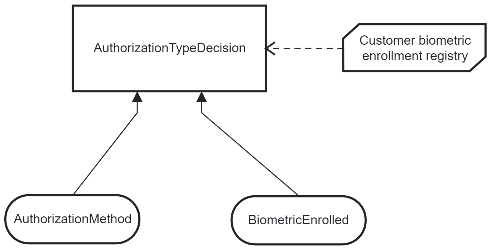

	This diagram describes a decision rule based on two input data, `AuthorizationMethod` that can be *PASSWORD* or *BIOMETRIC* and a flag `BiometricEnrolled` that indicates if the customer is enrolled on a device for biometric identification. The enrollment registry is the Knowledge Source which the BiometricEnrolled flag refers to.	

	In the previous step input data were populated as INPUTS of the task that reference the table. The diagram in Camunda for DMN is just a graphic representation, no element is executable but the decision element that in the diagram is name AuthorizationTypeDecision. In BPM process you refer to the ID of the diagram and not to the table.

	The table is configured as follows:

	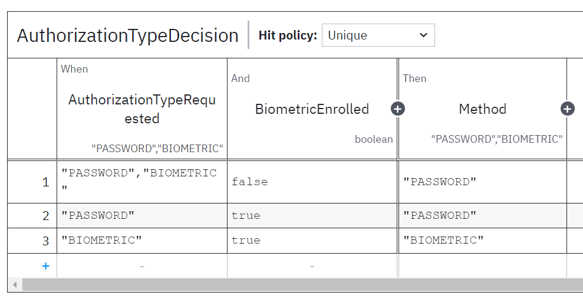

	In When and And columns there are the conditions of the two data input, in Then you have the result.
	In this case we have instructed the table with the following rules:
	* If customer wants to use a Password or Biometric means, but he wasn't previously enrolled to the Biometric authorization he will be directed to the PASSWORD flow
	* If customer wants to use the Password and was already enrolled to biometric identification allow the Password
	* If customer wants to use the Biometric device needs to be already enrolled. 

7. Deploy decision table and authorization process to Camunda. Change the html page with as follows:

	* Adapt the payload data in `confirmOperation`:

		```javascript
		async confirmOperation() {
			const amount = this.querySelector('#amount').value;
			const authMethod = this.querySelector('#authMethod').value;

			try {
			var processInstanceId;
			// Step 1. create process instance
			sendWorkflowRequest(
				{
				"workflowType": "AuthorizationProcess",
				"payload": [
					{
					"key": "AuthorizationType",
					"value": authMethod
					}
				]
				},
				'POST', 
				'instances')
				.then((response) => {
				if (response.status != 204 && response.status < 300) {
					response.json()
					.then((responseBody) => {
					processInstanceId = responseBody.uuid;
					console.log("1. Process data: " + JSON.stringify(responseBody));
					if (authMethod == "PASSWORD") {
						this.innerHTML = "<inserisci-password processInstanceId='"
								+ processInstanceId + "'></inserisci-password>";
					} else {
						alert("Completa l'operazione sull'altro dispositivo");
					}
					});
				}               
				})
			} catch (error) {
			console.error('Si è verificato un errore:', error);
			alert('Si è verificato un errore durante l\'autorizzazione dell\'operazione');
			}
		}
		```

	* Add a label for password invalid to inserisci-password web component and set up the new logic and the usage of process variables:

		```javascript
		customElements.define("inserisci-password", class extends HTMLElement {
		async connectedCallback() {
			const processInstanceId = this.getAttribute("processInstanceId");
			this.innerHTML = `
				<div>
					<h2 class="title">Conferma Password</h2>
					<form id="passwordForm">
						<label for="password">Password:</label>
						<input type="input-field" type="password" id="password" name="password" required>
						<span id="invalidPasswordLabel" style="color: red; display: none;">
						Invalid Password
						</span>
						<br>
						<button class="button" id="confirmBtn" type="submit">Conferma</button>
					</form>
				</div>
			`;
			this.querySelector('#passwordForm').addEventListener('submit', (event) => {
				event.preventDefault();
				const password = this.querySelector('#password').value;
				closeTask( processInstanceId,
				[ {
					'key': 'password',
					'value' : String(password)
					}
				]
				).then((completeTaskData) => {
						console.log("3. Task completion data: " + (completeTaskData == null ? null : 
													JSON.stringify(completeTaskData)));
				if (completeTaskData.status < 300) {
					completeTaskData.json()
					.then((result) => {
					const isValid = result.data.filter((key) => key.key == "isValid");
					if (isValid.length > 0 &&
						isValid[0].value) {
						this.innerHTML = '<h1 class="title">Operazione Autorizzata con successo</h1>';
					} else {
						const passwordStatus = result.data.filter((key) => key.key == "passwordError");
						if (passwordStatus.length > 0 &&
						passwordStatus[0].value == "PasswordLocked") {
							invalidPasswordLabel.textContent = "Too many errors, password is locked.";
						document.getElementById("confirmBtn").disabled = true;
						} else {
						invalidPasswordLabel.textContent = "Invalid Password. You have still " + 
							(2 - result.data.filter((key) => key.key == "tentativesCounter")[0].value)
							+ " tentatives.";
						}
						invalidPasswordLabel.style.display = 'inline';
					}
					})
				} else {
					console.log("Error in call " + completeTaskData.status)
				}
				}
				);
			});
		}
		})
		```

	* Finally adjust the 2 functions to call the sidecar as follows:

		```javascript
		async function closeTask(processInstanceId, payload) {
		// Step 2. get active task waiting for completion
		console.log("2. Close Task for process: " + processInstanceId);
		// Step 3. set authorization type
		return await sendWorkflowRequest(
			{
				payload
			},
			'POST', 
			'instances/' + processInstanceId)
		
		}

		async function sendWorkflowRequest(payload, method, restEndpoint) {
		return await fetch('http://localhost/workflow/' + restEndpoint, {
			method: method,
			headers: {
				'Content-Type': 'application/json',
				'Accept': 'application/json'
			},
			body: (method != "GET") ? JSON.stringify(payload) : null
			}
		)
		.then(function(response) {
			return response;
		});
	}
	```
 
8. Let's try everything. Run the following commands:
	```s
	# start the sidecar
	java -Dserver.port=0 -jar sidecar-0.0.1-SNAPSHOT.jar --spring.profiles.active=INCOMING
	
	java -Dserver.port=8900 -jar sidecar-0.0.1-SNAPSHOT.jar --spring.profiles.active=OUTGOING

	{camunda-bpm-run-7.20.0}/start.bat  

	{consul_folder}/consul.exe agent -dev -config-file=config.json
	
	{consul_template_folder}/consul-template.exe -config consul_template.hcl

	{nginx_folder}/nginx.exe
	```

	Go to the following url:

	```
	http://localhost:8100
	```

	and play with the page. Remember that to trigger the SMS you have to change the external service as done in the repository to include the service discovery integration with rest template. You should add the dependency to `spring-cloud-consul` and setup the application.yaml as done for the sidecar.

&nbsp;

<div id='step13'/>

### **Step 13: Working with external business data**

&nbsp;

> In last exercise we have created a sidecar for input and one for output. The input sidecar could store business data in an external source (database, shared cache or other storage) and the process could retrieve before to run a task the data. This approach allows a strong decoupling between the Workflow engine and its metadata and the business metadata. The sidecar store data and assign them an id. This identification code is provided to the Camunda Workflow that queries the sidecar to retrieve the business information. In this way the business information in the workflow tables will be limited.

1. Let's setup a shared cache in memory to share data between incoming and outgoing sidecars:
	* Add hazelcast dependency:

	```xml
	<dependency>
		<groupId>com.hazelcast</groupId>
		<artifactId>hazelcast-spring</artifactId>
		<version>5.3.6</version>
	</dependency>
	```

2. Configure a `hazelcast-client.yaml` in `src/main/resources`:

	```yaml
	hazelcast-client:
		network:
			smart-routing: true
			connection-timeout: 5000
			cluster-members:
			- localhost:5701
		cluster-name: dev
	```
3. Add endpoint to retrieve enrolled flag from customer id (name)

	`GET /business-data/enrollment/{id}` \
	`GET /business-data/payload/{id}`

	```java
	@Controller
	@Profile("INCOMING")
	@RequestMapping("/business-data")
	@RequiredArgsConstructor
	public class BusinessData {
		private final BusinessDataService service;

		@GetMapping("/enrollment/{id}")
		public ResponseEntity<EnrollmentDataEntity> getEnrollment(@PathVariable("id") String customerId) {
			return ResponseEntity.ok(service.getEnrollment(customerId));
		}

		@GetMapping("/payload/{id}")
		public ResponseEntity<BusinessDataEntityValue> getBusinessData(@PathVariable("id") String id) {
			return ResponseEntity.ok(service.getPayload(id));
		}
	}
	```

	and setup services. Note that to use Hazelcast compressed serialization out of the box the list is serialized
	in json and subsequently deserialized from json using another type of entity

	```java
	@Service
	@RequiredArgsConstructor
	public class BusinessDataService {
		private final BusinessDataRepository<EnrollmentDataEntity> repositoryEnrollment;
		private final BusinessDataRepository<BusinessDataEntity> repositoryBusiness;
		private final ObjectMapper objectMapper;

		public WorkflowRequestInstanceDto wrap(WorkflowRequestInstanceDto workflowRequestInstanceDto) {
			BusinessDataEntity entity;
			try {
				entity = new BusinessDataEntity(UUID.randomUUID().toString(),
						objectMapper.writeValueAsString(workflowRequestInstanceDto.getPayload()));
			} catch (JsonProcessingException e) {
				throw new RuntimeException(e);
			}
			repositoryBusiness.insert(entity);
			workflowRequestInstanceDto.setPayload(
					List.of(new PayloadData()
							.key("businessUuid")
							.value(new PayloadDataValue(entity.getId()))
					)
			);
			return workflowRequestInstanceDto;
		}

		public EnrollmentDataEntity getEnrollment(String customerId) {
			return repositoryEnrollment.select(customerId).orElse(null);
		}

		public BusinessDataEntityValue getPayload(String id) {
			return BusinessDataEntityValue.from(repositoryBusiness.select(id).orElse(null));
		}
	}
	```

	entities:

	```java
	@Data
	public class EnrollmentDataEntity {
		private String id;
		private String customerId;
		private Boolean enrolledFlg;
	}
	@Data
	@AllArgsConstructor
	public class BusinessDataEntity {
		private String id;
		@JsonIgnore()
		private String data;
	}

	@EqualsAndHashCode(callSuper = true)
	@Data
	public class BusinessDataEntityValue extends BusinessDataEntity {
		@JsonProperty("data")
		private List<PayloadData> dataList;

		public static BusinessDataEntityValue from(BusinessDataEntity businessDataEntity) {
			if (Objects.isNull(businessDataEntity)) return null;
			try {
				BusinessDataEntityValue result = new BusinessDataEntityValue();
				result.setDataList(new ObjectMapper().readValue(result.getData(),
						new TypeReference<>() {}));
				result.setId(businessDataEntity.getId());
				return result;
			} catch (JsonProcessingException e) {
				throw new RuntimeException(e);
			}
		}
	}
	```

	and repositories:

	```java
	
	// generic interface
	public interface BusinessDataRepository<T> {
		Optional<T> select(String id);

		int insert(T data);
	}

	// abstract implementation for share cache hazelcast
	public abstract class HazelcastBusinessDataRepository<T> implements BusinessDataRepository<T> {

		@Autowired
		private HazelcastInstance hazelcastInstance;

		// assign to the map the name of the type class
		private ConcurrentMap<String, T> retrieveMap() {
			String className = ((ParameterizedType) getClass().getGenericSuperclass())
					.getActualTypeArguments()[0]
					.getTypeName();
			return hazelcastInstance.getMap(className.substring(
					className.lastIndexOf(".") + 1)
			);
		}

		protected T put(String key, T value) {
			retrieveMap()
					.put(key, value);
			return value;
		}

		protected T get(String key) {
			return retrieveMap()
					.get(key);
		}
	}

	// implementation
	@Repository
	@RequiredArgsConstructor
	public class BusinessDataRepositoryBusiness extends HazelcastBusinessDataRepository<BusinessDataEntity> {

		@Override
		public void insert(BusinessDataEntity entity) {
			super.put(entity.getId(), entity);
		}

		@Override
		public Optional<BusinessDataEntity> select(String id) {
			return Optional.ofNullable(get(id));
		}
	}

	@Repository
	@RequiredArgsConstructor
	public class BusinessDataRepositoryEnrollment extends HazelcastBusinessDataRepository<EnrollmentDataEntity> {

		@Override
		public Optional<EnrollmentDataEntity> select(String id) {
			return Optional.ofNullable(get(id));
		}

		@Override
		public void insert(EnrollmentDataEntity data) {
			put(data.getId(), data);
		}
	}
	```

4. Adjust the WorkflowService to wrap business data in H2:

	```java
	@Autowired
	private final BusinessDataService businessDataService;

	public WorkflowInstanceDto update(UUID instanceId, WorkflowRequestInstanceDto workflowRequestInstanceDto) {
		WorkflowInstanceDto response = new WorkflowInstanceDto().uuid(instanceId);
		return act(response, businessDataService.wrap(workflowRequestInstanceDto));
	}

	public WorkflowInstanceDto create(WorkflowRequestInstanceDto workflowRequestInstanceDto) {
        return camundaService.startNewProcess(businessDataService.wrap(workflowRequestInstanceDto));
    }
	```

5. Download hazelcast from this [link](https://github.com/hazelcast/hazelcast/releases/download/v5.3.6/hazelcast-5.3.6-slim.zip). Unzip it where you prefer, check that in path there are not spaces. Correct the scripts `hz-start.bat` and `hz-cli.bat` changing `CALL common.bat` in `CALL bin\common.bat`
	Then proceed running the server.

	```dos
	bin\hz-start.bat
	```

6. Add groovy script in camunda to retrieve information for DMN table at task level. To do this, add an execution listener to the rule task and setup this groovy start script:

	```groovy
	try {
		def response = new URL('http://localhost:8900/business-data/payload/' + businessUuid).getText()

		def responseJson = new groovy.json.JsonSlurper().parseText(response)
		responseJson.data.each { variable ->
			execution.setVariableLocal(variable.key, variable.value)
		}
		execution.setVariableLocal("AuthorizationTypeRequested", execution.getVariableLocal("authorizationType"))
		def responseEnrollment = new URL('http://localhost:8900/business-data/enrollment/' + execution.getVariableLocal("customerId")).getText()
		if (responseEnrollment != null && !responseEnrollment.isEmpty()) {
			def responseEnrollmentJson = new groovy.json.JsonSlurper().parseText(responseEnrollment)
			execution.setVariableLocal("BiometricEnrolled",responseEnrollmentJson.enrolledFlg)
		} else {
			// default
			println "Response is null, biometric enrolled is false by default"
			execution.setVariableLocal("BiometricEnrolled",false)
		}
	} catch (Exception e) {
		throw new org.camunda.bpm.engine.ProcessEngineException("Errore durante la chiamata REST: ${e.message}")
	}
	```

	Remove input field because they are set by execution listener.
	**Remember** that *Inputs* field set up a task variable getting value from a process context. 
	If you would write the script above in inputs the *.setVariableLocal* would populate process variables.
	Instead the *execution listener* is executed at task level, so the variables will exist just in the runtime of the task
	without being stored in camunda database.

7. Add a groovy script to `Validate password` too, again in execution listener:

	```groovy
	try {
		def response = new URL('http://localhost:8900/business-data/payload/' + businessUuid).getText()

		def responseJson = new groovy.json.JsonSlurper().parseText(response)
		responseJson.data.each { variable ->
			execution.setVariableLocal(variable.key, variable.value)
		}
		execution.setVariable("isValid", null)
	} catch (Exception e) {
		throw new org.camunda.bpm.engine.ProcessEngineException("Errore durante la chiamata REST: ${e.message}")
	}
	```

	Change the expression to *execution.getVariableLocal("password).equals...*

8. Change the result evaluation in `external_page.html` of *authMethod == password* to show the *inserisci-password* webcomponent as follows: `if (responseBody.data.find(item => item.key == "authorizationTypeResult").value == "PASSWORD") {` to look for the authorizationTypeResult coming from the workflow. In this way if the user is not registered for biometric device the system switches to the password.

9. Finally create a HazelcastDataLoader that upload the enrollment registry at the startup:

	```java
	@Component
	@RequiredArgsConstructor
	@Profile("OUTGOING")
	public class HazelcastDataLoader implements CommandLineRunner {
		private final HazelcastInstance hazelcastInstance;
		private final ObjectMapper objectMapper;

		@Override
		public void run(String... args) throws Exception {
			IMap<String, EnrollmentDataEntity> map =
					hazelcastInstance.getMap("EnrollmentDataEntity");
			map.destroy();
			IndexConfig config = new IndexConfig(IndexType.HASH, "customerId");
			map.addIndex(config);
			new ObjectMapper(new YAMLFactory())
					.readValue(getClass().getClassLoader().getResourceAsStream("data.yaml"),
							new TypeReference<Map<String, List<EnrollmentDataEntity>>>() {
							})
					.get("enrollments")
					.forEach(record -> {
						map.computeIfAbsent(record.getId(), (key) -> record);
					});
		}
	}
	```
	and create a `data.yaml` file to populate the cache:

	```yaml
	enrollments:
	- id: 8d864f42-fa6d-4064-a578-2131d9732635
	customerId: Roberto
	enrolledFlg: 1
	- id: 087c416b-dc00-40cf-a759-ce3153d70e4c
	customerId: Gilda
	enrolledFlg: 0
	- id: 2b3531ff-84c1-4abb-ba55-1e2c84ee4b1f
	customerId: Matteo
	enrolledFlg: 1
	```

10. Now try the page: when you select BIOMETRIC with Gilda the page will show the `inserisci-password` web component. Instead when you select BIOMETRIC with Matteo and Roberto the page will show the alert to approve the operation from the other device.
When you select PASSWORD with each of them the password will work as expected.


