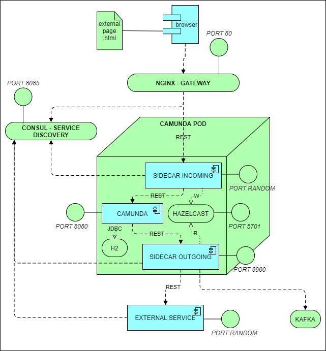

# <span style="color:darkorange">Camunda Workshop</span> 

_<span style="color:blue">**Author**</span>: Francesco Gandelli \
<span style="color:blue">**Date**</span>: 23 February 2024_

---

## <span style="color:darkorange">Goal of the project</span>

This project aims to create a progressive implementation of a Camunda workflow
starting from a standalone/concept design solution to the implementation.

---
## <span style="color:darkorange">The proposed approach</span>

The proposed approach of this project is as follows:
- Initially design a BPM process and test it using Camunda Standalone
- Then remove business data from the Workflow
- And then connect the Workflow to external resources
- Finally create a Camunda embedded solution

---
## <span style="color:darkorange">Proposed Technologies adoption</span>

The following technologies are used inside the project:
- SpringBoot 3.1
- Java 17.0.7+7 Temurin
- Camunda bpm run 7.20
- Camunda modeler 5.20
- Hazelcast 5.3.6
- Nginx 1.25.4
- Hashicorp Consul 1.17.3
- Confluent Community 7.6.0

---
## <span style="color:darkorange">Prerequisites</span>

The project is developed under Windows 11.

All the project **doesn't require administration rights** on your machine. All software involved are **portable**.

1) **Download** camunda standalone: https://downloads.camunda.cloud/release/camunda-bpm/run/7.20/camunda-bpm-run-7.20.0.zip

    **Check**: after extracting the archive, move to the extracted folder and run the script `start.bat`. Application should start in console.

2) **Download** camunda modeler: https://downloads.camunda.cloud/release/camunda-modeler/5.20.0/camunda-modeler-5.20.0-win-x64.zip

    **Check**: after extracting the archive, move to the extracted folder and run `Camunda Modeler.exe`

3) **Download** jdk 17+: https://adoptium.net/temurin/releases/?version=17 file .zip for windows x64.\
    Set up path variable. From windows search box run: 

    ```dos
	rundll32.exe sysdm.cpl,EditEnvironmentVariables
    ```

    Set up **JAVA_HOME** to the jdk 17 you just downloaded and extracted. Put in PATH the folder.

    **Check**: in console run `java -version` and check that the version is the right one.

4) **Download** Consul at the following link: https://developer.hashicorp.com/consul/install

    **Check**: after extracting the archive, move to the extracted folder and run `consul agent -dev`. Then go to `http://localhost:8500` and you should see the user interface of the service discovery.

5) **Download** Consul-template at the following link:  https://releases.hashicorp.com/consul-template/0.37.0/consul-template_0.37.0_windows_amd64.zip

    **Check**: see instruction at https://github.com/gandelfwiz/CamundaWorkshop/tree/step_11?tab=readme-ov-file#step11 points #2 and #4

6) **Download** Nginx at the following link: https://nginx.org/download/nginx-1.25.4.zip

    **Check**: see instruction at https://github.com/gandelfwiz/CamundaWorkshop/tree/step_11?tab=readme-ov-file#step11 points #3 and #4

7) **Download** Hazelcast at the following link: https://github.com/hazelcast/hazelcast/releases/download/v5.3.6/hazelcast-5.3.6-slim.zip

    **Check**: after extracting the archive, move to the extracted folder and run `bin\hz-start.bat`

8) **Download** Confluent Community components from this link: https://packages.confluent.io/archive/7.6/confluent-community-7.6.0.zip

    **Check**: follow the instruction at this link: https://docs.confluent.io/platform/current/installation/installing_cp/zip-tar.html

---
## <span style="color:darkorange">Let's start</span>

&nbsp;

### Table of contents
1. [Introduction](#intro)
2. [Create a simple workflow](https://github.com/gandelfwiz/CamundaWorkshop/tree/step_01)
3. [Create a variable and pass from one task to another - Failure](https://github.com/gandelfwiz/CamundaWorkshop/tree/step_02_not_ok)
4. [Create a variable and pass from one task to another - Success](https://github.com/gandelfwiz/CamundaWorkshop/tree/step_02_ok)
5. [Add a gateway. Create collapsed and extended subprocess](https://github.com/gandelfwiz/CamundaWorkshop/tree/step_03)
6. [Loop on password validation. Boundary events](https://github.com/gandelfwiz/CamundaWorkshop/tree/step_04)
7. [Escalate and call external rest service](https://github.com/gandelfwiz/CamundaWorkshop/tree/step_05)
8. Resiliency and Retry\
	I. [BPMN based](https://github.com/gandelfwiz/CamundaWorkshop/tree/step_06a_retry_bpmn)\
	II. [Camunda engine based](https://github.com/gandelfwiz/CamundaWorkshop/tree/step_06b_retry_camunda)
9. [Kafka integration through sidecar pattern](https://github.com/gandelfwiz/CamundaWorkshop/tree/step_07)
10. [Transaction and compensation](https://github.com/gandelfwiz/CamundaWorkshop/tree/step_08)
11. [Cross-process interaction](https://github.com/gandelfwiz/CamundaWorkshop/tree/step_09)
12. [Service mesh integration](https://github.com/gandelfwiz/CamundaWorkshop/tree/step_10)
13. [Integration with external application](https://github.com/gandelfwiz/CamundaWorkshop/tree/step_11)
14. [DMN and custom endpoints](https://github.com/gandelfwiz/CamundaWorkshop/tree/step_12)
15. [Working with external business data](https://github.com/gandelfwiz/CamundaWorkshop/tree/step_13)
16. [Externalize logs in kafka for connection to ELK](https://github.com/gandelfwiz/CamundaWorkshop/tree/step_14)
17. [Camunda Embedded](https://github.com/gandelfwiz/CamundaWorkshop/tree/step_15)
18. [Interaction with Spring Beans](https://github.com/gandelfwiz/CamundaWorkshop/tree/step_16)

&nbsp;

<div id="intro" />

### Introduction

&nbsp;

This repository contains a documented training course for Camunda 7.

Starting from basic flows and basic learning of Camunda, the course add elements simulating a distributed architecture where each component has to be integrated with others following specific patterns.

The final result is depicted in this picture:



Everything will run in your localhost without any administration right required. The node of the pod is conceptual, since Docker can't be executed in an environment without administration rights. Port interfaces are important to understand the need to have a service discovery and a gateway. The Single Page Application with the web component will externalize the form from Camunda moving it in a distributed environment.

This architecture approach is just a starting point. To use Camunda in agnostic manner the ideal would be to externalize also the task implementation with dedicated microservices or with an orchestration layer. Hazelcast is used inside the pod to keep aligned the data through a cache, but the cache should be out of the POD and should be persistent in a distributed environment and it should be accessible also from the orchestration layer that performs the task actions. Other changes could be done, for example Camunda should call the Outgoing sidecar through gRPC to be more efficient. And Sidecar could be written in a most performant framework or language than spring boot and java. Decoupling input/output layer and keeping Camunda pre-built as the state machine engine seems to be the best solution.

The exercise 16 _Externalize logs in kafka for connection to ELK_ will be limited just to the publishing of logs in Kafka. The connection of Kafka through _logstash_ to ELK isn't describe inside the exercise.

Have a good practice, good experiments and good learning! And above all enjoy!
